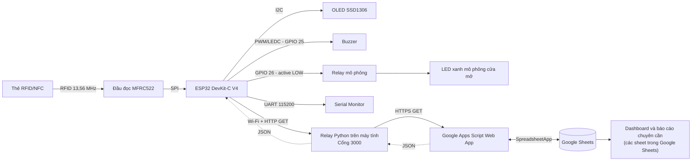
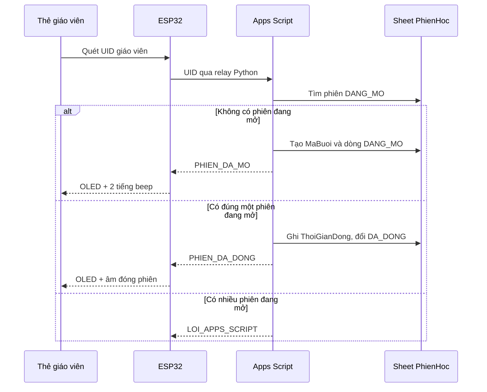
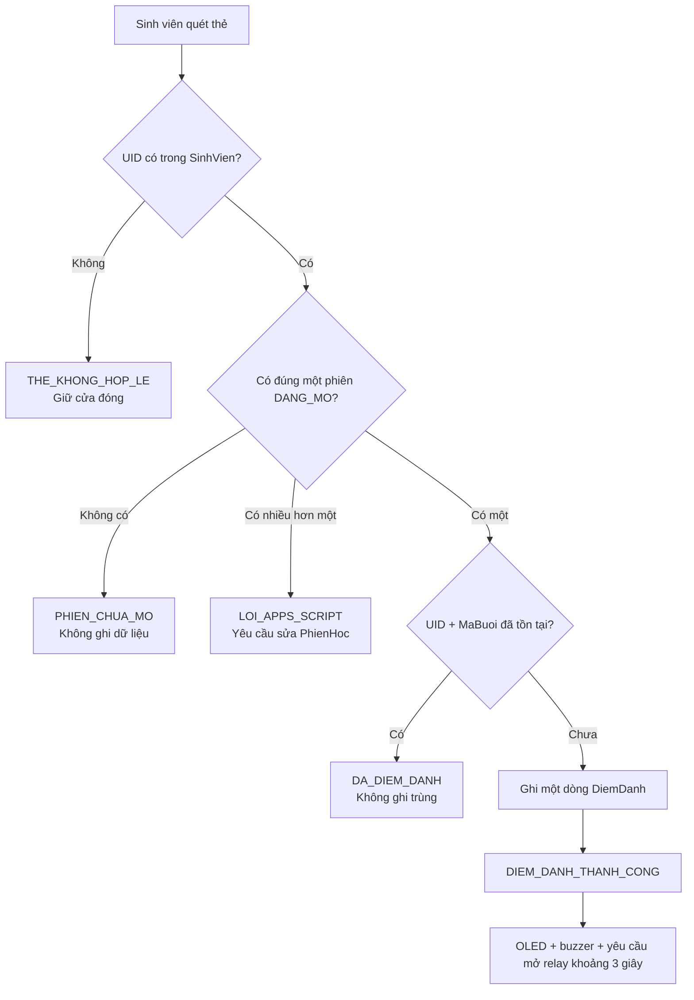

# BÁO CÁO TÓM TẮT DỰ ÁN

## HỆ THỐNG ĐIỂM DANH SINH VIÊN BẰNG RFID

**Loại dự án:** Bài tập nhập môn Internet of Things (IoT)  
**Phạm vi triển khai:** Mô phỏng, không chế tạo mạch thật  
**Nền tảng mô phỏng chính:** Wokwi  
**Mốc mã nguồn được khảo sát:** Nhánh `main`, commit `0df89ba`, ngày 04/08/2026  
**Mức độ hiện tại:** Nguyên mẫu hoạt động được trong môi trường mô phỏng

---

## 1. Tổng quan dự án

### 1.1. Mục tiêu

Dự án xây dựng một hệ thống điểm danh sinh viên bằng thẻ RFID/NFC với các chức năng chính:

- Giáo viên sử dụng một thẻ riêng để mở phiên điểm danh.
- Trong thời gian phiên đang mở, sinh viên quét thẻ để điểm danh.
- Mỗi sinh viên chỉ được ghi nhận một lần trong một phiên nhưng có thể tiếp tục điểm danh ở các phiên khác.
- Giáo viên quét thẻ lần tiếp theo sau cửa sổ chống quét lặp 3 giây để đóng phiên, sau đó hệ thống không nhận thêm lượt điểm danh cho đến khi có phiên mới.
- Kết quả quét được phản hồi bằng màn hình OLED, buzzer và relay/LED mô phỏng cửa.
- Dữ liệu sinh viên, giáo viên, phiên học và điểm danh được lưu trên Google Sheets.
- Dashboard cho phép theo dõi phiên hiện tại hoặc chọn một phiên đã có để xem lại.
- Báo cáo chuyên cần hướng tới công thức:

  ```text
  Tỷ lệ chuyên cần = Số phiên sinh viên đã điểm danh / Tổng số phiên học
  ```

Trong hệ thống hiện tại, mỗi lần giáo viên mở phiên sẽ tạo một dòng mới trong sheet `PhienHoc`. Vì vậy, hai phiên trong cùng một ngày vẫn được tính là hai buổi riêng biệt.

### 1.2. Phạm vi thực hiện

Dự án hiện được xây dựng để chạy trên Wokwi kết hợp với một chương trình relay Python trên máy tính và Google Apps Script/Google Sheets trên đám mây. Học phần không yêu cầu làm mạch thật nên chưa có kiểm thử với ESP32, đầu đọc RC522, relay hoặc nguồn điện ngoài đời thực.

MATLAB và Cisco Packet Tracer chưa được sử dụng trong dự án. Không có tệp `.m`, `.mlx`, `.slx`, `.pkt` hoặc `.pka` trong mã nguồn. Wokwi được lựa chọn vì công cụ này mô phỏng trực tiếp ESP32, đầu đọc MFRC522, OLED, buzzer, relay và chương trình Arduino C++, phù hợp với phạm vi hiện tại.

### 1.3. Mức độ đáp ứng yêu cầu đề bài

| Yêu cầu | Trạng thái | Bằng chứng trong dự án | Ghi chú trung thực |
| --- | --- | --- | --- |
| Xây dựng sơ đồ khối chung | Đạt | Kiến trúc đã được xác định từ `diagram.json`, firmware, `relay.py` và `Code.gs` | Sơ đồ được trình bày tại mục 2 |
| Xác định thiết bị phần cứng | Đạt ở mức mô phỏng | ESP32, MFRC522, OLED, buzzer, relay, LED và điện trở có trong `diagram.json` | Chưa lắp hoặc đo kiểm mạch thật |
| Xác định phương thức truyền thông | Đạt | SPI, I2C, GPIO/PWM, UART, Wi‑Fi, HTTP, HTTPS và JSON đều được dùng trong mã | HTTP từ ESP32 tới relay chưa mã hóa |
| Lập trình và chạy mô phỏng | Đạt bằng Wokwi | Firmware PlatformIO build thành công; Wokwi đã chạy và quét thẻ thủ công | Chưa có bộ kiểm thử tự động |
| MATLAB | Chưa thực hiện | Không có mã hoặc mô hình MATLAB | Không cần cho luồng điều khiển hiện tại; chỉ nên bổ sung nếu giảng viên bắt buộc |
| Cisco Packet Tracer | Chưa thực hiện | Không có tệp Packet Tracer | Nếu bổ sung, dự kiến chỉ dùng để minh họa phần mạng của hệ thống |

---

## 2. Sơ đồ khối chung của hệ thống

### 2.1. Sơ đồ phần cứng, mạng và dữ liệu



### 2.2. Vai trò của từng khối

| Khối | Vai trò |
| --- | --- |
| Thẻ RFID/NFC | Mang UID dùng để xác định sinh viên hoặc giáo viên |
| MFRC522 | Nhận dạng thẻ và truyền UID cho ESP32 qua SPI |
| ESP32 | Điều khiển trung tâm: đọc UID, kết nối Wi‑Fi, gửi yêu cầu, xử lý phản hồi và điều khiển thiết bị đầu ra |
| OLED | Hiển thị trạng thái hệ thống, UID, kết quả điểm danh và thông tin sinh viên |
| Buzzer | Phát mẫu âm khác nhau cho thành công, trùng, sai thẻ hoặc lỗi hệ thống |
| Relay và LED | Mô phỏng cơ cấu mở cửa; LED sáng khi relay cấp điện cho nhánh cửa |
| Relay Python | Cầu nối giữa môi trường Wokwi và Google Apps Script; kiểm tra và chuyển tiếp JSON |
| Google Apps Script | Xử lý nghiệp vụ giáo viên, phiên học, sinh viên, chống trùng và cập nhật Dashboard |
| Google Sheets | Lưu dữ liệu gốc và hiển thị Dashboard/báo cáo chuyên cần |

### 2.3. Chiều đi và chiều về của dữ liệu

**Chiều gửi yêu cầu:**

```text
Thẻ -> MFRC522 -> ESP32 -> HTTP relay.py -> HTTPS Apps Script -> Google Sheets
```

**Chiều trả kết quả:**

```text
Google Sheets -> Apps Script -> JSON -> relay.py -> JSON -> ESP32
-> OLED + buzzer + relay/LED
```

Relay Python không quyết định thẻ là giáo viên hay sinh viên. Quyền và nghiệp vụ được quyết định trong Google Apps Script dựa trên dữ liệu ở hai sheet `GiaoVien` và `SinhVien`.

---

## 3. Các thiết bị phần cứng cần sử dụng

### 3.1. Danh sách thiết bị

| STT | Thiết bị | Số lượng | Chức năng | Trạng thái trong dự án |
| ---: | --- | ---: | --- | --- |
| 1 | ESP32 DevKit-C V4 | 1 | Vi điều khiển trung tâm, có Wi‑Fi, điều khiển các ngoại vi | Đã mô phỏng |
| 2 | Đầu đọc RFID MFRC522/RC522 | 1 | Đọc UID thẻ RFID/NFC 13,56 MHz | Đã mô phỏng |
| 3 | Thẻ RFID/NFC | Nhiều thẻ | Đại diện tài khoản sinh viên và giáo viên | Đã mô phỏng bằng các preset thẻ Wokwi |
| 4 | OLED SSD1306 128 × 64 | 1 | Hiển thị trạng thái và thông tin người quét | Đã mô phỏng |
| 5 | Buzzer | 1 | Báo âm thanh theo kết quả xử lý | Đã mô phỏng |
| 6 | Relay module loại NPN | 1 | Mô phỏng đóng/cắt tải cửa | Đã mô phỏng |
| 7 | LED xanh | 1 | Đại diện trạng thái “cửa mở” | Đã mô phỏng |
| 8 | Điện trở 220 Ω | 1 | Hạn dòng cho LED | Đã mô phỏng |
| 9 | Máy tính | 1 | Chạy VS Code, PlatformIO, Wokwi và `relay.py` | Đã sử dụng |
| 10 | Kết nối Internet | 1 | Cho relay truy cập Google Apps Script và Google Sheets | Đã sử dụng trong thử nghiệm |

Google Apps Script và Google Sheets là thành phần phần mềm/dịch vụ đám mây, không phải linh kiện phần cứng.

### 3.2. Bảng nối chân trong mô phỏng

| Thiết bị | Chân thiết bị | Chân ESP32/điểm nối | Giao tiếp hoặc chức năng |
| --- | --- | --- | --- |
| MFRC522 | SDA/SS | GPIO 5 | Chọn chip SPI |
| MFRC522 | SCK | GPIO 18 | Xung clock SPI |
| MFRC522 | MISO | GPIO 19 | Dữ liệu từ RC522 về ESP32 |
| MFRC522 | MOSI | GPIO 23 | Dữ liệu từ ESP32 tới RC522 |
| MFRC522 | RST | GPIO 4 | Reset RC522 |
| MFRC522 | 3.3V | 3V3 | Nguồn trong mô phỏng |
| MFRC522 | GND | GND | Mass chung |
| OLED SSD1306 | SDA | GPIO 21 | Dữ liệu I2C |
| OLED SSD1306 | SCL | GPIO 22 | Xung clock I2C |
| OLED SSD1306 | VCC | 5V | Nguồn theo `diagram.json` của mô phỏng |
| OLED SSD1306 | GND | GND | Mass chung |
| Buzzer | Chân tín hiệu | GPIO 25 | PWM bằng LEDC |
| Buzzer | GND | GND | Mass chung |
| Relay | IN | GPIO 26 | Điều khiển digital, kích mức LOW |
| Relay | VCC | 5V | Nguồn module mô phỏng |
| Relay | GND | GND | Mass chung |
| Relay | COM | 5V | Nguồn cấp nhánh tải mô phỏng |
| Relay | NO | Anode LED xanh | Tiếp điểm thường mở |
| LED xanh | Cathode | Qua điện trở 220 Ω xuống GND | Mô phỏng cửa mở |

### 3.3. Lưu ý nếu chuyển sang mạch thật

Bảng nối trên mô tả đúng tệp Wokwi hiện tại, chưa phải một thiết kế điện đã được kiểm chứng ngoài thực tế. Nếu phát triển phần cứng thật cần kiểm tra thêm:

- Điện áp cho từng module OLED cụ thể; không mặc định mọi module SSD1306 đều giống nhau.
- Dòng tải và khả năng chịu tải của relay; không cấp tải công suất trực tiếp từ chân ESP32.
- Mức logic active LOW/active HIGH của module relay thực tế.
- Nguồn 3,3 V ổn định cho RC522 và nối mass chung.
- Mạch bảo vệ, diode dập xung và cách ly nếu relay điều khiển khóa điện.
- Khả năng đọc thẻ, khoảng cách anten và nhiễu điện từ thực tế.

---

## 4. Các phương thức truyền thông được sử dụng

| Đường truyền | Phương thức | Dữ liệu | Cấu hình hiện tại | Nhận xét |
| --- | --- | --- | --- | --- |
| Thẻ ↔ MFRC522 | RFID/NFC 13,56 MHz, ISO/IEC 14443A/MIFARE | UID thẻ | Thẻ 4 hoặc 7 byte trong Wokwi | UID dùng để nhận dạng, không phải cơ chế bảo mật mạnh |
| MFRC522 ↔ ESP32 | SPI | UID và lệnh điều khiển đầu đọc | SS 5, SCK 18, MISO 19, MOSI 23, RST 4 | Truyền nối tiếp đồng bộ tốc độ cao |
| OLED ↔ ESP32 | I2C | Nội dung màn hình | SDA 21, SCL 22, địa chỉ `0x3C` | Hai dây tín hiệu |
| ESP32 → buzzer | GPIO + PWM/LEDC | Tần số và thời gian phát âm | GPIO 25, LEDC kênh 0, độ phân giải 10 bit | Đây là tín hiệu điều khiển, không phải giao thức mạng |
| ESP32 → relay | GPIO digital | Bật/tắt cửa | GPIO 26, active LOW | Mốc tự đóng đặt là 3000 ms; việc đóng xảy ra ở vòng lặp kế tiếp |
| ESP32 → Serial Monitor | UART | Log khởi động, UID, URL, HTTP và trạng thái | 115200 baud | Firmware hiện chỉ phát log để kiểm tra và chẩn đoán |
| ESP32 ↔ điểm truy cập | Wi‑Fi 2,4 GHz | Gói TCP/IP | STA, SSID `Wokwi-GUEST`, kênh 6 | Cấu hình dành cho Wokwi |
| ESP32 → relay.py | HTTP GET trên TCP/IP | Query `uid` và JSON phản hồi | `http://host.wokwi.internal:3000/?uid=...` | Nội bộ mô phỏng, chưa mã hóa |
| relay.py → Apps Script | HTTPS GET | Query `uid` và JSON phản hồi | Web App `/exec`, timeout 30 giây | Có TLS trên đoạn relay–Google |
| Apps Script ↔ Sheets | API nội bộ `SpreadsheetApp` | Dòng dữ liệu, xác thực dữ liệu và vùng ô | Spreadsheet gắn với dự án Apps Script | Không có cơ sở dữ liệu riêng |

### 4.1. Định dạng trao đổi ở tầng ứng dụng

UID được gửi bằng tham số URL:

```text
GET /?uid=01020304
```

Một phản hồi điểm danh thành công có cấu trúc tương đương:

```json
{
  "success": true,
  "status": "DIEM_DANH_THANH_CONG",
  "uid": "01020304",
  "mssv": "SV001",
  "hoTen": "Nguyen Huy Hoang",
  "lop": "DHTTMT01",
  "maBuoi": "B260804-01"
}
```

ESP32 chủ yếu quyết định hành động dựa trên trường `status`, không chỉ dựa vào mã HTTP.

### 4.2. Các trạng thái nghiệp vụ chính

| Trạng thái | Ý nghĩa |
| --- | --- |
| `PHIEN_DA_MO` | Giáo viên vừa mở phiên mới |
| `PHIEN_DA_DONG` | Giáo viên vừa đóng phiên đang mở |
| `PHIEN_CHUA_MO` | Sinh viên quét khi chưa có phiên |
| `DIEM_DANH_THANH_CONG` | Sinh viên hợp lệ và được ghi nhận |
| `DA_DIEM_DANH` | Sinh viên đã có dữ liệu trong phiên này |
| `THE_KHONG_HOP_LE` | UID không có trong danh sách giáo viên hoặc sinh viên |
| `THIEU_UID` | Yêu cầu không chứa UID |
| `KHONG_TIM_THAY_SHEET` | Thiếu một sheet dữ liệu bắt buộc |
| `LOI_APPS_SCRIPT` | Lỗi xử lý, sai cấu trúc hoặc không lấy được khóa |
| `LOI_TIMEOUT_GOOGLE` | Google không phản hồi trong thời gian cho phép |

---

## 5. Kiến trúc phần mềm và dữ liệu

### 5.1. Tổ chức mã nguồn

| Tệp/thư mục | Nhiệm vụ |
| --- | --- |
| `platformio.ini` | Chọn ESP32, Arduino Framework và các thư viện phụ thuộc |
| `wokwi.toml` | Chỉ đường dẫn firmware `.bin` và `.elf` cho Wokwi |
| `diagram.json` | Khai báo linh kiện, vị trí và dây nối mô phỏng |
| `include/CauHinh.h` | Pin, Wi‑Fi, timeout, relay, thời gian mở cửa và UID mô phỏng |
| `src/main.cpp` | Khởi tạo, vòng lặp đọc thẻ, chống quét lặp và điều phối |
| `src/DiemDanh.cpp` | Kết nối Wi‑Fi, gửi HTTP, đọc JSON và ánh xạ kết quả |
| `src/ManHinh.cpp` | Điều khiển OLED, rút gọn chuỗi và tách họ tên |
| `src/ThietBi.cpp` | Điều khiển relay, tự đóng cửa và các mẫu âm buzzer |
| `relay.py` | HTTP server cục bộ và cầu nối HTTPS tới Apps Script |
| `apps-script/Code.gs` | API nghiệp vụ, thao tác Google Sheets và cập nhật Dashboard |

### 5.2. Thư viện và nền tảng

Lần build kiểm tra ngày 04/08/2026 sử dụng:

- PlatformIO, platform `espressif32` phiên bản 7.0.1.
- Board `esp32dev`.
- Arduino Framework package `3.20017.241212`.
- `MFRC522` phiên bản 1.4.12.
- `Adafruit GFX Library` phiên bản 1.12.6.
- `Adafruit SSD1306` phiên bản 2.5.17.
- Python tiêu chuẩn; `relay.py` không yêu cầu cài framework web bên ngoài.
- Google Apps Script và Google Sheets.

### 5.3. Cấu trúc dữ liệu Google Sheets bắt buộc

Tên và thứ tự cột được `Code.gs` kiểm tra chính xác trước khi xử lý.

**Sheet `SinhVien`:**

| UID | MSSV | HoTen | Lop |
| --- | --- | --- | --- |

**Sheet `GiaoVien`:**

| UID | MaGV | HoTen | BoMon |
| --- | --- | --- | --- |

**Sheet `PhienHoc`:**

| MaBuoi | UIDGiaoVien | MaGV | HoTenGiaoVien | ThoiGianMo | ThoiGianDong | TrangThai |
| --- | --- | --- | --- | --- | --- | --- |

**Sheet `DiemDanh`:**

| ThoiGian | UID | MSSV | HoTen | Lop | TrangThai | MaBuoi |
| --- | --- | --- | --- | --- | --- | --- |

Ngoài bốn sheet bắt buộc còn có `Dashboard` và `BaoCaoDiemDanh`:

- `Dashboard` dùng ô `C3` để chọn mã buổi, `F3` làm checkbox/nút xem, `K5` lưu phiên đang xem và `K6` lưu lựa chọn thủ công.
- `Code.gs` lấy các dòng `DiemDanh` có `MaBuoi` khớp `K5`, sắp xếp mới nhất trước rồi chép sáu cột đầu vào vùng `A9:F...`.
- `BaoCaoDiemDanh`, các thẻ tổng hợp và biểu đồ tròn phụ thuộc công thức/định dạng đã được đặt trong Google Sheet.
- `Code.gs` hiện không tạo lại hoặc kiểm tra đầy đủ công thức của `Dashboard` và `BaoCaoDiemDanh`. Do đó, chỉ có source code trong Git là chưa đủ để tái tạo toàn bộ giao diện báo cáo nếu mất file Google Sheet.

---

## 6. Nguyên lý hoạt động

### 6.1. Khởi động hệ thống

1. ESP32 mở Serial Monitor ở 115200 baud.
2. Khởi tạo OLED SSD1306.
3. Cấu hình relay ở trạng thái đóng và khởi tạo LEDC cho buzzer.
4. Khởi tạo bus SPI và MFRC522.
5. Kết nối Wi‑Fi `Wokwi-GUEST` ở chế độ STA.
6. OLED chuyển sang trạng thái chờ quét thẻ.

Lỗi `LEDC is not initialized` trước đây đã được xử lý bằng cách gọi `ledcSetup()` trước `ledcAttachPin()` và chỉ phát âm khi kênh LEDC khởi tạo thành công.

### 6.2. Đọc và chuẩn hóa UID

1. ESP32 kiểm tra có thẻ mới bằng `PICC_IsNewCardPresent()`.
2. Đọc UID bằng `PICC_ReadCardSerial()`.
3. Ghép mỗi byte thành hai ký tự hexadecimal và chuyển thành chữ hoa.
4. Dừng giao tiếp với thẻ và dừng Crypto1.
5. Nếu cùng UID xuất hiện lại trong vòng 1000 ms, firmware bỏ qua lần quét lặp.
6. UID được gửi tới relay Python.

Thẻ giáo viên dùng preset NFC Tag màu xám của Wokwi với UID chuẩn:

```text
04:11:22:33:44:55:66
```

Trong lần chạy thực tế, lớp mô phỏng MFRC522 từng chỉ trả `04112233`. Firmware hiện có một xử lý tương thích rất cụ thể: chỉ khi kích thước đọc được là 4 byte và UID đúng `04112233`, hệ thống mới khôi phục thành `04112233445566` trước khi gửi API. Đây là workaround dành cho mô phỏng Wokwi, không phải cơ chế phân quyền. Vai trò giáo viên vẫn được xác định từ sheet `GiaoVien`.

### 6.3. Giáo viên mở phiên



Mã buổi có dạng:

```text
ByyMMdd-NN
```

Ví dụ `B260804-01` là phiên thứ nhất ngày 04/08/2026. Nếu mở thêm phiên trong cùng ngày, số thứ tự tiếp tục thành `-02`, `-03`, v.v. Việc tạo mã dùng múi giờ của Spreadsheet và được đặt trong khóa xử lý của Apps Script để giảm xung đột đồng thời.

Apps Script dùng `LockService` với thời gian chờ 5 giây. Sau một lần quét giáo viên thành công, phản hồi được lưu trong Script Properties 3 giây; lần quét lặp cùng UID trong khoảng này trả lại kết quả cũ thay vì lập tức đảo từ mở sang đóng.

### 6.4. Sinh viên điểm danh



Khóa chống trùng là cặp:

```text
UID sinh viên + MaBuoi
```

Do đó sinh viên chỉ có một dòng trong một phiên nhưng được phép có dòng mới ở phiên tiếp theo.

### 6.5. Giáo viên đóng phiên

Khi đang có đúng một dòng `DANG_MO`, lần quét thẻ giáo viên hợp lệ tiếp theo sẽ:

1. Ghi thời điểm vào cột `ThoiGianDong`.
2. Đổi trạng thái phiên thành `DA_DONG`.
3. Trả `PHIEN_DA_DONG` cho ESP32.
4. Giữ relay đóng và hiển thị kết thúc điểm danh.
5. Các lượt sinh viên sau đó nhận `PHIEN_CHUA_MO` và không được ghi vào `DiemDanh`.

Giới hạn hiện tại là API chưa kiểm tra người đóng có phải đúng giáo viên đã mở phiên hay không. Bất kỳ UID hợp lệ nào trong sheet `GiaoVien` cũng có thể đóng phiên đang mở.

### 6.6. Phản hồi vật lý mô phỏng

| Kết quả | OLED | Buzzer | Relay/cửa |
| --- | --- | --- | --- |
| Giáo viên mở phiên | Hiện thẻ giáo viên và “ĐÃ MỞ PHIÊN” | 2 beep 1500 Hz | Giữ đóng |
| Giáo viên đóng phiên | Hiện “ĐÃ ĐÓNG PHIÊN” | 1 beep 700 Hz | Giữ đóng |
| Điểm danh thành công | Hiện họ tên, MSSV, lớp | 1 beep 1200 Hz | Mở ít nhất khoảng 3 giây, đóng ở vòng lặp kế tiếp sau khi đủ thời gian |
| Đã điểm danh | Hiện thông tin và trạng thái trùng | 2 beep 1000 Hz | Giữ đóng |
| Phiên chưa mở | Hiện yêu cầu chờ giáo viên | 2 beep 600 Hz | Giữ đóng |
| Thẻ không hợp lệ | Hiện từ chối truy cập | 1 beep 450 Hz kéo dài | Giữ đóng |
| Lỗi hệ thống | Hiện tên lỗi | 3 beep 650 Hz | Đóng để bảo đảm trạng thái an toàn |

OLED giới hạn tối đa bốn dòng, mỗi dòng khoảng 21 ký tự. Họ tên dài được tách thành tối đa hai dòng.

---

## 7. Lập trình và chạy mô phỏng

### 7.1. Công cụ sử dụng thực tế

- Visual Studio Code.
- PlatformIO để quản lý thư viện và biên dịch firmware ESP32.
- Wokwi để mô phỏng mạch và chạy firmware.
- Python 3 để chạy relay cục bộ.
- Google Apps Script Editor để triển khai Web App.
- Google Sheets để lưu dữ liệu và hiển thị Dashboard.
- Git/GitHub để quản lý phiên bản mã nguồn.

### 7.2. Biên dịch firmware

Tại thư mục dự án:

```powershell
cd "C:\Users\Minh Thanh\Desktop\iot-tx2-project-ver1\RFID-Attendance-VSCode"
pio run
```

Cũng có thể dùng nút **PlatformIO: Build** trong VS Code. Khi build thành công, `wokwi.toml` sử dụng hai tệp:

```text
.pio/build/esp32dev/firmware.bin
.pio/build/esp32dev/firmware.elf
```

Kết quả kiểm tra gần nhất:

| Hạng mục | Kết quả |
| --- | --- |
| Trạng thái build | SUCCESS |
| RAM | 47.044 / 327.680 byte, tương đương 14,4% |
| Flash | 842.089 / 1.310.720 byte, tương đương 64,2% |

Kết quả trên xác nhận mã nguồn biên dịch được, không đồng nghĩa với việc mọi tình huống nghiệp vụ đã được kiểm thử tự động.

### 7.3. Chạy relay Python

```powershell
python relay.py
```

Relay lắng nghe tại cổng 3000. Có thể kiểm tra trạng thái bằng:

```powershell
Invoke-RestMethod http://127.0.0.1:3000/health
```

Phản hồi mong đợi:

```json
{
  "success": true,
  "status": "RELAY_SAN_SANG",
  "version": "2026-08-03-v1"
}
```

Relay có các hành vi chính:

- `GET /health`: kiểm tra server cục bộ.
- `GET /?uid=...`: chuẩn hóa UID rồi gọi Google Apps Script.
- Tự đi theo redirect của Apps Script.
- Kiểm tra phản hồi phải là JSON object có trường `status`.
- Parse, kiểm tra rồi chuyển tiếp nội dung JSON nghiệp vụ hợp lệ về ESP32.
- Trả lỗi 502/504 nếu Google lỗi, sai JSON hoặc timeout.
- Không có cơ chế retry, hàng đợi hoặc lưu tạm khi mất mạng.

### 7.4. Chuẩn bị Google Apps Script và Google Sheets

1. Tạo đủ các sheet và đúng tiêu đề cột tại mục 5.3.
2. Dán nội dung `apps-script/Code.gs` vào dự án Apps Script gắn với Spreadsheet.
3. Lưu mã và triển khai dưới dạng Web App.
4. Chọn quyền thực thi phù hợp và cấp quyền truy cập cho đối tượng thử nghiệm.
5. Cập nhật URL `/exec` trong `relay.py` nếu tạo deployment mới.
6. Mở lại Google Sheet để `onOpen()` tạo menu `RFID` và cấu hình Dashboard.

Thay đổi `Code.gs` chỉ bấm lưu là chưa đủ để URL deployment cũ chạy mã mới; khi cần cập nhật Web App phải tạo phiên bản/triển khai mới theo giao diện Apps Script.

### 7.5. Chạy Wokwi

1. Build firmware bằng PlatformIO.
2. Khởi động `relay.py` và giữ cửa sổ terminal đang chạy.
3. Start Simulation trong Wokwi.
4. Chờ Serial báo OLED, relay/buzzer, RFID và Wi‑Fi đã khởi tạo.
5. Trong bảng điều khiển MFRC522, chọn thẻ rồi nhấn **TAP**.
6. Với thẻ giáo viên màu xám, có thể dùng phím `N` để chọn NFC Tag và `T` để quét.
7. Theo dõi đồng thời Serial Monitor, OLED, LED cửa và Google Sheet.

### 7.6. Kịch bản kiểm thử đề xuất

| STT | Thao tác | Kết quả mong đợi |
| ---: | --- | --- |
| 1 | Khởi động khi relay và Internet sẵn sàng | Wi‑Fi kết nối, OLED chờ quét |
| 2 | Sinh viên quét khi chưa mở phiên | `PHIEN_CHUA_MO`, không ghi `DiemDanh` |
| 3 | Giáo viên quét lần đầu | Tạo một `MaBuoi`, trạng thái `DANG_MO` |
| 4 | Sinh viên hợp lệ quét lần đầu | Ghi một dòng, LED cửa mở khoảng 3 giây rồi đóng ở vòng lặp kế tiếp |
| 5 | Cùng sinh viên quét lại sau hơn 1 giây trong cùng phiên | `DA_DIEM_DANH`, không thêm dòng |
| 6 | Sinh viên khác hợp lệ quét | Mỗi sinh viên có một dòng riêng |
| 7 | UID không nằm trong hai bảng | `THE_KHONG_HOP_LE`, cửa đóng |
| 8 | Giáo viên quét lại sau cửa sổ chống lặp | Phiên chuyển sang `DA_DONG` |
| 9 | Sinh viên quét sau khi đóng | `PHIEN_CHUA_MO`, không thêm dòng |
| 10 | Giáo viên mở phiên thứ hai cùng ngày | Mã buổi tăng từ `-01` lên `-02` |
| 11 | Chọn mã buổi cũ trên Dashboard và tick `F3` | Thẻ tổng hợp và danh sách chuyển sang phiên đã chọn |
| 12 | Tắt relay Python hoặc mạng | ESP32 hiển thị lỗi, relay cửa giữ đóng |

---

## 8. Kết quả đã quan sát được

Các kết quả sau đã được quan sát hoặc xác nhận qua log Serial, phản hồi API, Google Sheet và quá trình thử thủ công:

- Firmware hiện tại build thành công bằng PlatformIO.
- ESP32 mô phỏng đã chạy qua trình tự khởi tạo và in log cho OLED, buzzer, relay và MFRC522. OLED có kiểm tra kết quả `begin()` và LEDC có kiểm tra kết quả `ledcSetup()`; RC522 và relay chưa có self-test/xác minh đầy đủ.
- ESP32 kết nối được `Wokwi-GUEST` và gọi relay cục bộ.
- Đường truyền ESP32 → relay.py → Google Apps Script đã trả HTTP 200 và JSON.
- Gọi Web App thiếu UID đã trả `THIEU_UID`.
- UID giáo viên đầy đủ `04112233445566` đã mở phiên `B260804-01` và ghi dòng vào `PhienHoc`.
- Giáo viên đã đóng được phiên bằng lần quét tiếp theo.
- Sinh viên UID `01020304` đã được ghi vào `DiemDanh` trong phiên đang mở.
- Cơ chế chống điểm danh lặp trong cùng phiên đã hoạt động khi thử thủ công.
- Dashboard đã hiển thị 1/4 sinh viên, tỷ lệ phiên 25%, và `BaoCaoDiemDanh` hiển thị 1/1 = 100% cho sinh viên đã điểm danh trong dữ liệu thử.
- Dropdown/nút xem phiên trên Dashboard đã chọn được `B260804-01`.
- Lỗi UID thẻ xám bị rút còn 4 byte đã được xử lý trong firmware; sau khi build lại, người dùng xác nhận thẻ giáo viên hoạt động.

Phần chép trực tiếp danh sách `DiemDanh` vào vùng `Dashboard!A9:F...` đã được triển khai trong `Code.gs` để thay cho công thức `FILTER` từng gây `#ERROR!`. Tuy nhiên, chưa có ảnh hoặc log cuối cùng chứng minh đầy đủ mọi dòng của bảng chi tiết sau thay đổi này; vì vậy báo cáo chỉ khẳng định chức năng đã có trong mã, chưa khẳng định đã kiểm thử hết mọi trường hợp.

---

## 9. Đánh giá MATLAB và Cisco Packet Tracer

### 9.1. MATLAB

MATLAB chưa được dùng trong dự án hiện tại. Với mục tiêu đọc thẻ, điều khiển GPIO và gửi HTTP từ ESP32, MATLAB không phải công cụ mô phỏng phần cứng trực tiếp cần thiết.

Nếu giảng viên bắt buộc có MATLAB, có thể bổ sung một phần độc lập để:

- Nhập dữ liệu điểm danh từ CSV.
- Vẽ tỷ lệ chuyên cần theo sinh viên hoặc theo phiên.
- Phân tích số sinh viên đi học theo thời gian.
- Thử nghiệm thuật toán cảnh báo sinh viên có tỷ lệ dưới ngưỡng.

Những nội dung này hiện chỉ là hướng mở rộng, chưa được lập trình hay chạy thử.

### 9.2. Cisco Packet Tracer

Cisco Packet Tracer chưa được dùng trong dự án hiện tại. Nếu được bổ sung, dự án dự kiến chỉ dùng Packet Tracer để minh họa cấu hình mạng, router, access point, DHCP hoặc phân đoạn mạng IoT; phần chức năng RFID vẫn được mô phỏng bằng Wokwi.

Nếu giảng viên bắt buộc có Packet Tracer, có thể xây dựng một mô hình mạng khái niệm gồm:

```text
Thiết bị IoT -> Access Point -> Router/Internet -> Cloud Server
```

Mô hình đó chỉ chứng minh kết nối mạng, không thay thế kết quả mô phỏng chức năng RFID trên Wokwi. Hiện dự án không có tệp Packet Tracer nên không được tuyên bố là đã mô phỏng trên công cụ này.

### 9.3. Kết luận về công cụ mô phỏng

Nếu từ “như” trong đề bài mang nghĩa liệt kê các công cụ có thể lựa chọn, Wokwi đã đáp ứng yêu cầu lập trình và mô phỏng. Nếu giảng viên yêu cầu bắt buộc cả MATLAB, Cisco Packet Tracer và Wokwi, dự án hiện mới hoàn thành phần Wokwi và cần bổ sung hai phần còn lại.

---

## 10. Hạn chế và rủi ro hiện tại

### 10.1. Giới hạn nghiệp vụ

- Hệ thống chỉ cho phép tối đa một phiên `DANG_MO` trên toàn Spreadsheet.
- Bất kỳ giáo viên hợp lệ nào cũng có thể đóng phiên do giáo viên khác mở.
- Không có lịch học, môn học, phòng học hoặc danh sách sinh viên riêng cho từng lớp/phiên.
- Mọi sinh viên trong sheet `SinhVien` đều có thể điểm danh vào phiên đang mở.
- Phiên không tự đóng khi giáo viên quên quét lần hai.
- Nếu có hơn một dòng `DANG_MO`, toàn bộ nghiệp vụ bị dừng và phải sửa dữ liệu thủ công.
- Mã buổi dùng năm hai chữ số; nếu xóa mã lớn nhất trong ngày thì số đó có thể được sử dụng lại.

### 10.2. Giới hạn bảo mật

- Web App và relay chưa dùng API key, token, chữ ký HMAC hay đăng nhập.
- UID nằm trên query URL và có thể xuất hiện trong log.
- Đoạn Wokwi/ESP32 tới relay dùng HTTP thuần, không phải HTTPS.
- UID RFID có thể bị sao chép; chỉ dùng UID không đủ an toàn cho hệ thống kiểm soát ra vào thực tế.
- Dữ liệu UID, MSSV, họ tên và lớp chưa có chính sách phân quyền, lưu vết truy cập hoặc thời hạn lưu trữ.
- Người biết URL API có thể giả lập yêu cầu quét nếu Web App được mở công khai.

### 10.3. Giới hạn kỹ thuật

- `host.wokwi.internal` chỉ phù hợp khi chạy Wokwi và relay trên máy tính; ESP32 thật phải dùng địa chỉ server khác.
- Relay không retry và không lưu hàng đợi khi mất mạng; người dùng phải quét lại.
- ESP32 đặt connect timeout 10 giây và response timeout 30 giây; relay đặt timeout chờ Google 30 giây. Hai lớp gần như không có khoảng dự phòng nếu Google phản hồi sát giới hạn.
- Firmware chỉ coi mã trả về `<= 0` là lỗi kết nối; mọi mã HTTP dương, kể cả 4xx/5xx, vẫn được đọc và thử tách trường `status` từ JSON.
- Parser JSON trên ESP32 là parser chuỗi đơn giản, không thay thế thư viện JSON đầy đủ.
- Các thao tác tìm UID, phiên và lượt trùng trên Google Sheets duyệt tuyến tính; dữ liệu lớn có thể chậm và chạm giới hạn Apps Script.
- Dashboard sao chép display value nên thời gian trên bảng chi tiết trở thành chuỗi và chỉ là snapshot tại lần cập nhật.
- Sửa tay `DiemDanh` không tự làm mới danh sách chi tiết nếu không gọi lại chức năng Dashboard.
- Firmware dùng một số thao tác chặn như HTTP GET và `delay()`; trong tình huống mạng treo, vòng lặp điều khiển có thể phản hồi chậm.
- Thông báo “khởi tạo RFID thành công” hiện chưa dựa trên self-test hay kiểm tra version thực tế của RC522. Log khởi tạo relay/buzzer cũng chưa phải bằng chứng đầy đủ rằng cả hai thiết bị đã hoạt động; LEDC có log lỗi riêng nhưng dòng “thành công” chung vẫn được in sau đó.
- Cửa chỉ được kiểm tra để tự đóng tại đầu vòng `loop()`. Nếu sau khi mở cửa có thao tác HTTP hoặc `delay()` chặn chương trình, thời gian mở thực tế có thể dài hơn mốc 3000 ms.
- Workaround `04112233` → `04112233445566` chỉ phù hợp preset NFC xám đang dùng trong mô phỏng và có nguy cơ đụng với một thẻ 4 byte thật cùng UID.

### 10.4. Giới hạn kiểm thử

- Chưa có unit test, integration test hoặc load test tự động.
- Thư mục `test` chỉ chứa tệp hướng dẫn mặc định của PlatformIO.
- Chưa đo thời gian đáp ứng trung bình, tỷ lệ lỗi mạng hoặc giới hạn số dòng của Google Sheets.
- Chưa thử đồng thời nhiều thiết bị ESP32.
- Chưa có kiểm thử phần cứng thật, nguồn, relay tải thực hoặc độ ổn định dài hạn.

---

## 11. Hướng phát triển đề xuất

Theo thứ tự ưu tiên:

1. Thêm môn học, lớp, phòng và danh sách sinh viên được phép cho từng phiên.
2. Chỉ cho đúng giáo viên đã mở phiên được đóng phiên đó.
3. Thêm thời gian tự đóng phiên và chức năng quản trị phiên bị quên.
4. Dùng token/chữ ký yêu cầu và HTTPS đầu cuối; không coi UID là bằng chứng xác thực duy nhất.
5. Thay parser JSON thủ công trên ESP32 bằng thư viện JSON phù hợp.
6. Đưa các công thức và cấu hình Dashboard vào mã khởi tạo để có thể tái tạo Sheet hoàn toàn.
7. Thêm log sự kiện, mã thiết bị và idempotency key để tránh đảo trạng thái khi request bị gửi lại.
8. Tối ưu tra cứu dữ liệu khi số sinh viên và số phiên tăng lớn.
9. Viết kịch bản kiểm thử tự động cho Wokwi, relay và Apps Script.
10. Nếu cần triển khai thật, thay relay cục bộ bằng backend ổn định hoặc cho ESP32 gọi HTTPS trực tiếp với xác minh chứng thư.
11. Nếu yêu cầu học phần thay đổi, bổ sung MATLAB cho phân tích dữ liệu và Packet Tracer cho sơ đồ mạng; không dùng hai công cụ này để thay thế mô phỏng RFID trên Wokwi.

---

## 12. Kết luận

Dự án đã hoàn thành một nguyên mẫu nhập môn IoT có luồng nghiệp vụ rõ ràng: giáo viên mở phiên, sinh viên điểm danh trong phiên, giáo viên đóng phiên, dữ liệu được lưu theo mã buổi và hiển thị trên Google Sheets. Hệ thống kết hợp được nhiều lớp công nghệ gồm RFID, SPI, I2C, GPIO/PWM, Wi‑Fi, HTTP/HTTPS, JSON, Python relay, Google Apps Script và Dashboard.

Phần đã được triển khai và thử nghiệm thực tế là firmware ESP32 trên Wokwi, relay Python và Apps Script/Google Sheets. Firmware hiện build thành công và các luồng chính đã chạy qua mô phỏng thủ công. MATLAB và Cisco Packet Tracer chưa được sử dụng. Hệ thống chưa đủ điều kiện triển khai như một sản phẩm thật vì còn phụ thuộc môi trường mô phỏng, chưa có phần cứng thực, chưa có kiểm thử tự động và còn thiếu cơ chế bảo mật/xác thực cần thiết.

Với phạm vi một dự án nhập môn và yêu cầu không làm mạch thật, kết quả hiện tại đáp ứng được mục tiêu minh họa kiến trúc IoT đầu-cuối và hoạt động điểm danh cơ bản. Các giới hạn đã nêu cần được giữ nguyên trong báo cáo để phản ánh đúng mức độ hoàn thành của dự án.

---

## Tài liệu tham khảo chính

- Mã nguồn hiện tại của dự án tại nhánh `main`.
- Tài liệu Wokwi về MFRC522: <https://docs.wokwi.com/parts/board-mfrc522>
- Tài liệu Web Apps của Google Apps Script: <https://developers.google.com/apps-script/guides/web>
- Tài liệu Wi‑Fi Arduino ESP32 của Espressif: <https://docs.espressif.com/projects/arduino-esp32/en/latest/api/wifi.html>
- Thư viện MFRC522: <https://github.com/miguelbalboa/rfid>
