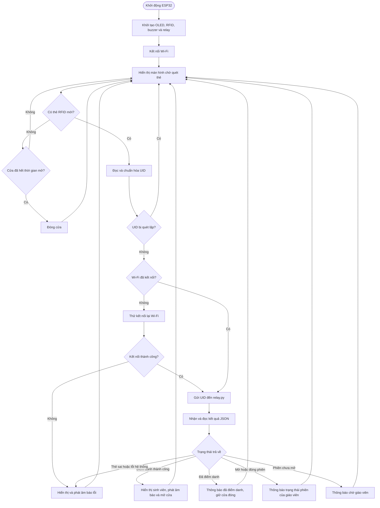
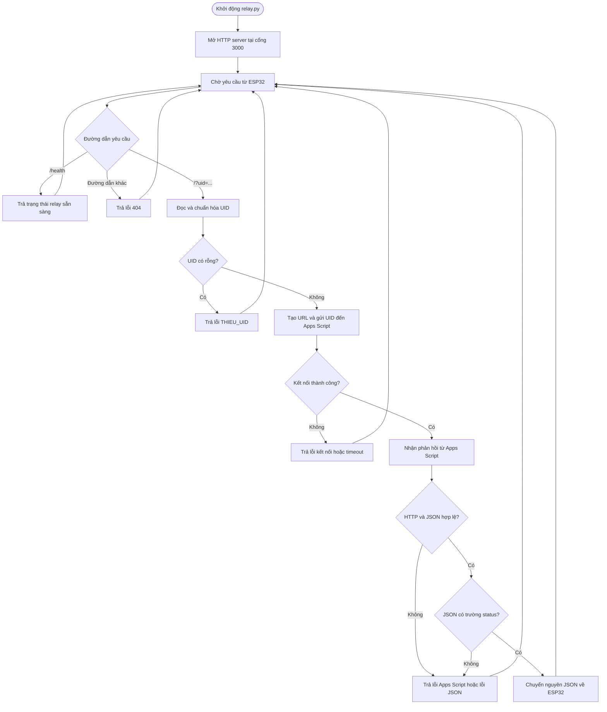
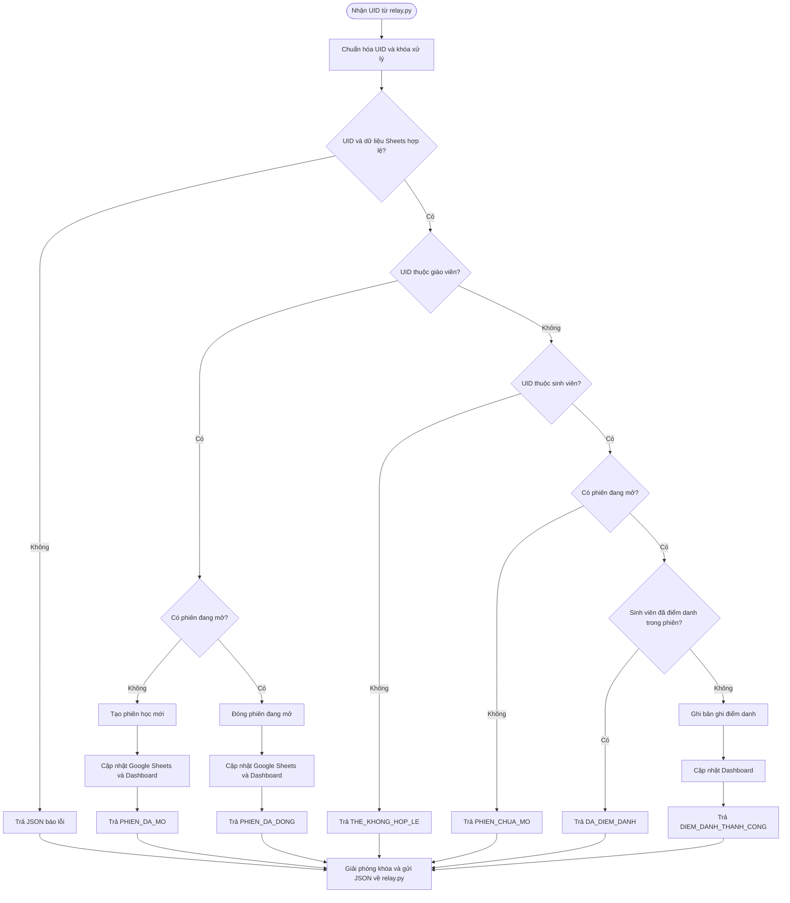

# Lưu đồ hoạt động hệ thống điểm danh RFID

## 1. Lưu đồ xử lý của ESP32

## 2. Lưu đồ xử lý của `relay.py`

## 3. Lưu đồ xử lý của Google Apps Script

Luồng kết nối chung: **Thẻ RFID → ESP32 → `relay.py` → Google Apps Script/Google Sheets → `relay.py` → ESP32 → OLED, buzzer và relay cửa**.
