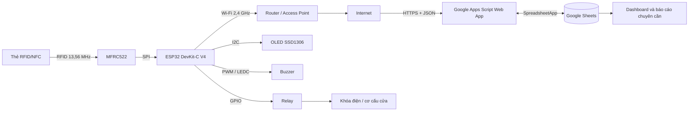
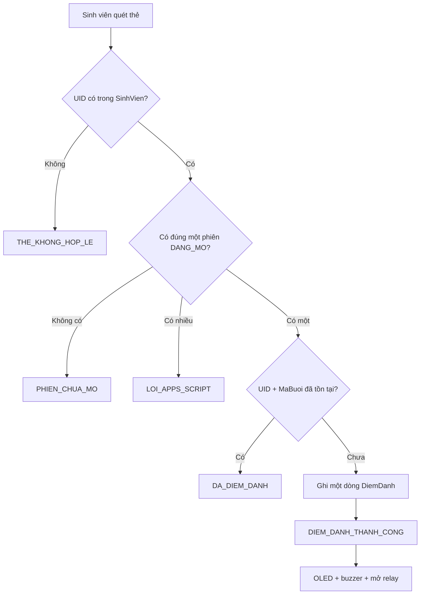
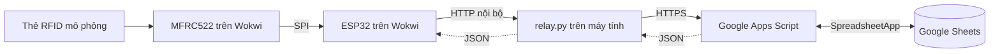

# TÀI LIỆU KỸ THUẬT HỆ THỐNG ĐIỂM DANH SINH VIÊN BẰNG RFID

> Đây là tài liệu kỹ thuật tham khảo để tìm hiểu dự án, xây dựng báo cáo hoặc làm slide. Tài liệu không phải một báo cáo học thuật hoàn chỉnh để nộp.

- **Loại dự án:** Bài tập nhập môn Internet of Things (IoT)
- **Mô hình đã thực hiện:** Mô phỏng trên Wokwi
- **Kiến trúc mục tiêu:** ESP32 thật gọi trực tiếp Google Apps Script qua HTTPS
- **Mốc mã nguồn cập nhật:** Nhánh `main`, commit `433db96`, ngày 04/08/2026
- **Mức độ hiện tại:** Nguyên mẫu hoạt động trong môi trường mô phỏng

---

## 1. Tổng quan dự án

### 1.1. Mục tiêu

Dự án xây dựng hệ thống điểm danh bằng thẻ RFID/NFC với các chức năng:

- Giáo viên dùng thẻ riêng để mở hoặc đóng phiên điểm danh.
- Sinh viên quét thẻ trong lúc phiên đang mở.
- Mỗi sinh viên chỉ được ghi nhận một lần trong một phiên nhưng có thể điểm danh lại ở phiên khác.
- OLED, buzzer và relay phản hồi kết quả quét.
- Google Apps Script xử lý nghiệp vụ; Google Sheets lưu dữ liệu và hiển thị Dashboard.
- Relay mô phỏng cơ cấu mở cửa sau khi điểm danh thành công.

Mỗi lần mở phiên tạo một dòng mới trong `PhienHoc`. Hai phiên trong cùng một ngày vẫn được xem là hai buổi riêng biệt. Tỷ lệ chuyên cần dự kiến được tính theo:

```text
Tỷ lệ chuyên cần = Số phiên sinh viên đã điểm danh / Tổng số phiên học
```

### 1.2. Phạm vi

Phần đã được xây dựng và thử nghiệm là mô phỏng Wokwi kết hợp Google Apps Script, Google Sheets và một relay Python cục bộ. Dự án chưa chế tạo hoặc kiểm thử mạch thật.

MATLAB và Cisco Packet Tracer không được sử dụng. Trong phạm vi bài nhập môn, Wokwi đảm nhiệm việc mô phỏng ESP32, MFRC522, OLED, buzzer, relay và chương trình Arduino C++.

### 1.3. Mức độ đáp ứng yêu cầu

| Yêu cầu | Trạng thái | Thành phần đáp ứng |
| --- | --- | --- |
| Xây dựng sơ đồ khối chung | Đạt | Sơ đồ hệ thống thật và sơ đồ mô phỏng tại mục 2 |
| Xác định thiết bị phần cứng | Đạt về thiết kế | Danh sách và bảng chân tại mục 3 |
| Xác định phương thức truyền thông | Đạt | RFID, SPI, I2C, GPIO/PWM, Wi-Fi, HTTP/HTTPS và JSON |
| Lập trình và chạy mô phỏng | Đạt | Firmware PlatformIO, Wokwi, Apps Script và Google Sheets |
| Kiểm thử phần cứng thật | Chưa thực hiện | Ngoài phạm vi nguyên mẫu hiện tại |

---

## 2. Sơ đồ khối chung của hệ thống

### 2.1. Kiến trúc dự kiến của hệ thống thật



Đây là kiến trúc chính khi triển khai thực tế. ESP32 kết nối Wi-Fi và gọi trực tiếp Google Apps Script bằng HTTPS; máy tính không cần chạy liên tục.

### 2.2. Vai trò các khối

| Khối | Vai trò |
| --- | --- |
| Thẻ RFID/NFC | Mang UID đại diện cho sinh viên hoặc giáo viên |
| MFRC522 | Đọc UID và truyền dữ liệu cho ESP32 qua SPI |
| ESP32 | Điều khiển trung tâm, gửi yêu cầu và xử lý phản hồi |
| Router/Access Point | Cung cấp kết nối Wi-Fi và Internet |
| Google Apps Script | Kiểm tra thẻ, quản lý phiên và chống điểm danh trùng |
| Google Sheets | Lưu danh mục, phiên học, điểm danh và Dashboard |
| OLED | Hiển thị trạng thái và thông tin người quét |
| Buzzer | Phát mẫu âm tương ứng với kết quả |
| Relay và khóa điện | Mô phỏng hoặc thực hiện thao tác mở cửa |

### 2.3. Chiều đi và chiều về của dữ liệu

```text
Chiều đi:
Thẻ → MFRC522 → ESP32 → Wi-Fi/Internet → Apps Script → Google Sheets

Chiều về:
Google Sheets → Apps Script → JSON → ESP32 → OLED + buzzer + relay
```

UID được dùng để tra cứu người dùng. Apps Script, không phải ESP32, quyết định UID thuộc giáo viên hay sinh viên và thực hiện nghiệp vụ tương ứng.

---

## 3. Các thiết bị phần cứng cần sử dụng

### 3.1. Danh sách cho hệ thống thật

| STT | Thiết bị | Số lượng | Chức năng |
| ---: | --- | ---: | --- |
| 1 | ESP32 DevKit-C V4 | 1 | Vi điều khiển trung tâm có Wi-Fi |
| 2 | MFRC522 | 1 | Đọc thẻ RFID/NFC 13,56 MHz |
| 3 | Thẻ RFID/NFC | Nhiều | Đại diện giáo viên và sinh viên |
| 4 | OLED SSD1306 128 × 64 | 1 | Hiển thị trạng thái |
| 5 | Buzzer | 1 | Báo âm thanh |
| 6 | Relay tương thích logic ESP32 | 1 | Điều khiển tải hoặc khóa |
| 7 | Khóa điện/cơ cấu cửa | 1 | Cơ cấu chấp hành thực tế |
| 8 | Nguồn ESP32 và ngoại vi | 1 bộ | Cấp nguồn ổn định |
| 9 | Nguồn riêng cho khóa | Khi cần | Đáp ứng điện áp và dòng của khóa |
| 10 | Router hoặc Access Point | 1 | Kết nối Internet |
| 11 | Dây nối, board thử hoặc PCB | 1 bộ | Lắp ráp mạch |
| 12 | Mạch bảo vệ tải/diode/cách ly | Khi cần | Bảo vệ ESP32 khi điều khiển tải cảm |

LED xanh và điện trở 220 Ω trong `diagram.json` chỉ biểu diễn trạng thái cửa mở trên Wokwi, không bắt buộc trong sản phẩm cuối.

### 3.2. Bảng nối chân

| Thiết bị | Chân thiết bị | Chân ESP32 | Giao tiếp |
| --- | --- | --- | --- |
| MFRC522 | SDA/SS | GPIO 5 | SPI chip select |
| MFRC522 | SCK | GPIO 18 | SPI clock |
| MFRC522 | MISO | GPIO 19 | SPI dữ liệu về ESP32 |
| MFRC522 | MOSI | GPIO 23 | SPI dữ liệu tới MFRC522 |
| MFRC522 | RST | GPIO 4 | Reset |
| MFRC522 | 3.3V/GND | 3V3/GND | Nguồn |
| OLED | SDA | GPIO 21 | I2C data |
| OLED | SCL | GPIO 22 | I2C clock |
| Buzzer | Signal | GPIO 25 | PWM/LEDC |
| Relay | IN | GPIO 26 | GPIO digital |

Trong Wokwi, OLED và relay đang nối nguồn 5 V, còn MFRC522 dùng 3,3 V. Khi làm mạch thật phải kiểm tra datasheet của đúng module OLED và relay đang sử dụng; không được mặc định mọi module đều có điện áp và mức logic giống mô phỏng.

### 3.3. Lưu ý khi làm mạch thật

- MFRC522 cần nguồn 3,3 V ổn định và mass chung với ESP32.
- Kiểm tra relay kích mức LOW hay HIGH và khả năng tương thích logic 3,3 V.
- Không cấp khóa điện hoặc tải công suất trực tiếp từ chân ESP32.
- Chọn nguồn khóa theo điện áp, dòng khởi động và dòng duy trì thực tế.
- Bổ sung diode dập xung, transistor/driver, cầu chì hoặc cách ly nếu cần.
- Kiểm tra khoảng cách đọc thẻ và nhiễu điện từ sau khi lắp ráp.

---

## 4. Các phương thức truyền thông

### 4.1. Hệ thống thật

| Đường truyền | Phương thức | Dữ liệu/chức năng |
| --- | --- | --- |
| Thẻ ↔ MFRC522 | RFID 13,56 MHz | UID thẻ |
| MFRC522 ↔ ESP32 | SPI | UID và lệnh điều khiển đầu đọc |
| ESP32 ↔ OLED | I2C | Nội dung màn hình, địa chỉ `0x3C` |
| ESP32 → buzzer | PWM/LEDC | Tần số và thời gian âm báo |
| ESP32 → relay | GPIO digital | Bật/tắt cơ cấu cửa |
| ESP32 → Serial Monitor | UART 115200 baud | Log và chẩn đoán |
| ESP32 ↔ Access Point | Wi-Fi 2,4 GHz | Kết nối TCP/IP |
| ESP32 → Apps Script | HTTPS GET | UID trong query, phản hồi JSON |
| Apps Script ↔ Sheets | `SpreadsheetApp` | Đọc và ghi dữ liệu |

Ví dụ yêu cầu:

```text
GET /exec?uid=01020304
```

Ví dụ phản hồi:

```json
{
  "success": true,
  "status": "DIEM_DANH_THANH_CONG",
  "uid": "01020304",
  "mssv": "SV001",
  "hoTen": "Nguyen Van A",
  "lop": "DHTTMT01",
  "maBuoi": "B260804-01"
}
```

### 4.2. Truyền thông riêng trong mô phỏng

Trong mô phỏng hiện tại, đoạn từ ESP32 mô phỏng tới cầu nối trên máy tính dùng HTTP nội bộ; đoạn từ cầu nối tới Google Apps Script dùng HTTPS. JSON được chuyển tiếp ngược về ESP32. Chi tiết thành phần cầu nối chỉ phục vụ Wokwi được trình bày tại mục 8.

---

## 5. Kiến trúc phần mềm và dữ liệu

### 5.1. Kiến trúc phần mềm chính

Trong hệ thống thật, phần mềm gồm:

- Firmware ESP32: đọc thẻ, kết nối mạng, gọi HTTPS và điều khiển ngoại vi.
- Google Apps Script: toàn bộ nghiệp vụ giáo viên, sinh viên, phiên và chống trùng.
- Google Sheets: dữ liệu gốc, Dashboard và báo cáo chuyên cần.

Chương trình cầu nối cục bộ không thuộc kiến trúc phần mềm chính; vai trò của nó chỉ được trình bày tại mục 8.

### 5.2. Cấu trúc mã nguồn hiện tại

```text
nhapmoniot-project/
├── src/
│   ├── main.cpp
│   ├── DiemDanh.cpp
│   ├── ManHinh.cpp
│   └── ThietBi.cpp
├── include/
│   ├── CauHinh.h
│   ├── DiemDanh.h
│   ├── ManHinh.h
│   └── ThietBi.h
├── apps-script/Code.gs
├── diagram.json
├── platformio.ini
└── wokwi.toml
```

| Tệp | Trách nhiệm |
| --- | --- |
| `main.cpp` | Khởi tạo, đọc UID, chống đọc lặp và điều phối |
| `DiemDanh.cpp/.h` | Wi-Fi, HTTP, đọc phản hồi và xử lý trạng thái |
| `ManHinh.cpp/.h` | Điều khiển OLED |
| `ThietBi.cpp/.h` | Buzzer, relay và tự đóng cửa |
| `CauHinh.h` | GPIO, Wi-Fi, timeout và cấu hình relay mô phỏng |
| `Code.gs` | Nghiệp vụ và cập nhật Dashboard |
| `diagram.json` | Sơ đồ mạch Wokwi |

### 5.3. Cấu trúc Google Sheets

Tên và thứ tự cột được `Code.gs` kiểm tra trước khi xử lý.

**`SinhVien`:**

| UID | MSSV | HoTen | Lop |
| --- | --- | --- | --- |

**`GiaoVien`:**

| UID | MaGV | HoTen | BoMon |
| --- | --- | --- | --- |

**`PhienHoc`:**

| MaBuoi | UIDGiaoVien | MaGV | HoTenGiaoVien | ThoiGianMo | ThoiGianDong | TrangThai |
| --- | --- | --- | --- | --- | --- | --- |

**`DiemDanh`:**

| ThoiGian | UID | MSSV | HoTen | Lop | TrangThai | MaBuoi |
| --- | --- | --- | --- | --- | --- | --- |

Ngoài ra còn có `Dashboard` và `BaoCaoDiemDanh`.

- `UID` liên kết thẻ với người dùng.
- `MaBuoi` liên kết phiên với các dòng điểm danh.
- Khóa chống trùng nghiệp vụ là `UID + MaBuoi`.
- `Dashboard` dùng `C3` chọn phiên, `F3` làm checkbox xem, `K5` lưu phiên đang xem và `K6` lưu lựa chọn thủ công.
- `Code.gs` chép các dòng phù hợp vào `Dashboard!A9:F...`, mới nhất trước.
- Công thức, biểu đồ và định dạng của Dashboard/BaoCaoDiemDanh phụ thuộc Google Sheet có sẵn và chưa được tạo lại hoàn toàn bằng mã.

---

## 6. Nguyên lý hoạt động

### 6.1. Khởi động

1. Mở Serial ở 115200 baud.
2. Khởi tạo OLED.
3. Đặt relay về trạng thái đóng và khởi tạo LEDC cho buzzer.
4. Khởi tạo SPI và MFRC522.
5. Kết nối Wi-Fi.
6. Hiển thị màn hình chờ quét thẻ.

Nếu Wi-Fi hoặc API lỗi, firmware đóng relay, hiển thị lỗi và phát âm báo. Trạng thái an toàn mặc định là giữ cửa đóng.

### 6.2. Đọc và chuẩn hóa UID

Firmware phát hiện thẻ mới, đọc từng byte UID, chuyển sang hexadecimal chữ hoa và loại bỏ dấu cách/dấu hai chấm trước khi gửi. Cùng một UID xuất hiện lại trong vòng 1000 ms sẽ bị bỏ qua ở firmware.

Preset NFC xám của Wokwi có UID `04:11:22:33:44:55:66`. Do một trường hợp mô phỏng chỉ trả bốn byte `04112233`, firmware có workaround khôi phục thành `04112233445566`. Cách xử lý này chỉ dành cho Wokwi, không dùng để nhận diện thẻ thật.

### 6.3. Giáo viên mở và đóng phiên

Khi UID có trong `GiaoVien`, Apps Script tìm phiên `DANG_MO`:

- Chưa có phiên: tạo `MaBuoi`, ghi thời gian mở và trả `PHIEN_DA_MO`.
- Có đúng một phiên: ghi thời gian đóng, đổi thành `DA_DONG` và trả `PHIEN_DA_DONG`.
- Có nhiều phiên: trả `LOI_APPS_SCRIPT` để yêu cầu sửa dữ liệu.

Mã buổi có dạng `ByyMMdd-NN`, ví dụ `B260804-01`. Apps Script dùng `LockService` chờ tối đa 5 giây và lưu phản hồi quét giáo viên trong 3 giây để tránh một lần quét bị hiểu thành cả mở lẫn đóng.

### 6.4. Sinh viên điểm danh và chống trùng



Sinh viên chỉ có một dòng trong mỗi phiên, nhưng được tạo dòng mới khi tham gia phiên khác. Sau khi giáo viên đóng phiên, lượt quét sinh viên trả `PHIEN_CHUA_MO` và không ghi dữ liệu.

### 6.5. Phản hồi OLED, buzzer và relay

| Kết quả | OLED | Buzzer | Relay/cửa |
| --- | --- | --- | --- |
| `PHIEN_DA_MO` | Đã mở phiên | 2 beep, 1500 Hz | Đóng |
| `PHIEN_DA_DONG` | Đã đóng phiên | 1 beep, 700 Hz | Đóng |
| `PHIEN_CHUA_MO` | Chờ giáo viên | 2 beep, 600 Hz | Đóng |
| `DIEM_DANH_THANH_CONG` | Họ tên, MSSV, lớp | 1 beep, 1200 Hz | Mở khoảng 3 giây |
| `DA_DIEM_DANH` | Thông báo đã điểm danh | 2 beep, 1000 Hz | Đóng |
| `THE_KHONG_HOP_LE` | Từ chối truy cập | 1 beep dài, 450 Hz | Đóng |
| Lỗi hệ thống | Tên lỗi | 3 beep, 650 Hz | Đóng |

OLED hiển thị tối đa bốn dòng, khoảng 21 ký tự mỗi dòng; họ tên dài được tách thành tối đa hai dòng.

### 6.6. Dashboard và chuyên cần

Sau khi thay đổi phiên hoặc điểm danh, Apps Script cập nhật danh sách chi tiết trên Dashboard. Người dùng có thể chọn phiên cũ để xem lại. `BaoCaoDiemDanh` và các biểu đồ sử dụng dữ liệu trong các sheet để tổng hợp tỷ lệ chuyên cần.

### 6.7. Các trạng thái chính

```text
PHIEN_DA_MO
PHIEN_DA_DONG
PHIEN_CHUA_MO
DIEM_DANH_THANH_CONG
DA_DIEM_DANH
THE_KHONG_HOP_LE
THIEU_UID
KHONG_TIM_THAY_SHEET
LOI_APPS_SCRIPT
LOI_TIMEOUT_GOOGLE
LOI_KET_NOI_GOOGLE
```

---

## 7. Phương án triển khai hệ thống thật

Mục này mô tả phương án dự kiến, chưa phải kết quả đã kiểm thử.

1. Lắp ESP32, MFRC522, OLED và buzzer theo bảng chân.
2. Dùng relay/driver phù hợp để điều khiển khóa và nguồn riêng của khóa.
3. Thay Wi-Fi Wokwi bằng SSID/mật khẩu thực tế.
4. Thay luồng HTTP tới `host.wokwi.internal` bằng HTTPS trực tiếp tới Apps Script `/exec`.
5. Cấu hình xác minh chứng thư TLS phù hợp trên ESP32.
6. Giữ nguyên cấu trúc JSON và nghiệp vụ trong Apps Script nếu API không đổi.
7. Loại bỏ cầu nối mô phỏng; máy tính không cần chạy thường trực.
8. Kiểm tra nguồn, mức logic, trạng thái relay lúc khởi động và trạng thái an toàn khi mất mạng.

Kiến trúc thật chưa được xác nhận hoạt động. Đặc biệt, HTTPS trực tiếp, chứng thư TLS, relay tải thật, khóa điện và nguồn cần được thử nghiệm riêng.

---

## 8. Lập trình và chạy mô phỏng trên Wokwi

### 8.1. Kiến trúc mô phỏng



Đây chỉ là kiến trúc phục vụ mô phỏng. `relay.py`:

- Nhận UID từ Wokwi tại cổng 3000 bằng HTTP.
- Chuẩn hóa UID và gửi tiếp đến Apps Script bằng HTTPS.
- Kiểm tra phản hồi là JSON object có trường `status` rồi chuyển tiếp về ESP32.
- Không xác định thẻ là giáo viên hay sinh viên.
- Không mở/đóng phiên và không chống điểm danh trùng.
- Không thay đổi nghiệp vụ; toàn bộ quyết định vẫn nằm trong `Code.gs`.
- Sẽ bị loại bỏ khi ESP32 thật gọi HTTPS trực tiếp.

### 8.2. Công cụ

- VS Code và PlatformIO.
- Wokwi.
- Python 3 để chạy relay mô phỏng.
- Google Apps Script Editor và Google Sheets.
- Git/GitHub để quản lý phiên bản.

### 8.3. Chuẩn bị Google Sheets và Apps Script

1. Tạo bốn sheet dữ liệu đúng tên và đúng thứ tự cột tại mục 5.3.
2. Chuẩn bị `Dashboard` và `BaoCaoDiemDanh` nếu cần giao diện tổng hợp.
3. Dán `apps-script/Code.gs` vào Apps Script gắn với Spreadsheet.
4. Triển khai dưới dạng Web App và cấp quyền phù hợp cho thử nghiệm.
5. Cập nhật URL `/exec` trong `relay.py` khi tạo deployment mới.
6. Mở lại Spreadsheet để `onOpen()` tạo menu `RFID` và cấu hình Dashboard.

Sau khi sửa `Code.gs`, cần tạo phiên bản/deployment mới để URL Web App chạy mã mới.

### 8.4. Build và chạy

Từ thư mục gốc của repository:

```powershell
pio run
python relay.py
```

Kiểm tra relay:

```powershell
Invoke-RestMethod http://127.0.0.1:3000/health
```

Phản hồi mong đợi:

```json
{
  "success": true,
  "status": "RELAY_SAN_SANG",
  "version": "2026-08-03-v1"
}
```

Sau đó:

1. Start Simulation trong Wokwi.
2. Chờ ESP32 khởi tạo và kết nối `Wokwi-GUEST`.
3. Chọn thẻ trong bảng MFRC522 rồi nhấn **TAP**.
4. Với NFC Tag giáo viên màu xám, dùng `N` để chọn và `T` để quét.
5. Theo dõi Serial Monitor, OLED, LED cửa và Google Sheets.

`wokwi.toml` sử dụng:

```text
.pio/build/esp32dev/firmware.bin
.pio/build/esp32dev/firmware.elf
```

---

## 9. Kịch bản kiểm thử

| STT | Thao tác | Kết quả mong đợi |
| ---: | --- | --- |
| 1 | Khởi động khi relay và Internet sẵn sàng | OLED chờ quét, Wi-Fi kết nối |
| 2 | Sinh viên quét khi chưa mở phiên | `PHIEN_CHUA_MO`, không ghi dữ liệu |
| 3 | Giáo viên quét lần đầu | Tạo `MaBuoi`, phiên `DANG_MO` |
| 4 | Sinh viên hợp lệ quét | Ghi một dòng, mở cửa khoảng 3 giây |
| 5 | Cùng sinh viên quét lại trong phiên | `DA_DIEM_DANH`, không thêm dòng |
| 6 | Sinh viên khác quét | Tạo dòng riêng |
| 7 | UID lạ quét | `THE_KHONG_HOP_LE`, cửa đóng |
| 8 | Giáo viên quét lại sau chống lặp | Phiên chuyển `DA_DONG` |
| 9 | Sinh viên quét sau khi đóng | `PHIEN_CHUA_MO` |
| 10 | Mở phiên thứ hai cùng ngày | Mã tăng từ `-01` lên `-02` |
| 11 | Chọn phiên cũ trên Dashboard | Hiển thị dữ liệu đúng phiên |
| 12 | Tắt relay Python hoặc mạng | Báo lỗi và giữ cửa đóng |
| 13 | Gửi yêu cầu thiếu UID | Trả `THIEU_UID` |
| 14 | Thiếu/sai tiêu đề sheet | Trả lỗi sheet hoặc `LOI_APPS_SCRIPT` |

---

## 10. Kết quả đã xác nhận

### 10.1. Đã triển khai và kiểm thử

- Firmware hiện tại build thành công bằng PlatformIO.
- Lần xác minh ngày 04/08/2026 dùng platform Espressif32 7.0.1, Arduino framework `3.20017.241212`, MFRC522 1.4.12, Adafruit GFX 1.12.6 và SSD1306 2.5.17.
- RAM sử dụng 47.044/327.680 byte (14,4%); Flash 842.089/1.310.720 byte (64,2%).
- Hệ thống đã chạy trong Wokwi và ESP32 mô phỏng đã đọc UID.
- Luồng Wokwi → cầu nối mô phỏng → Apps Script → Sheets đã hoạt động và trả JSON.
- Google Sheets đã ghi được phiên học và dữ liệu điểm danh.
- Mở phiên, đóng phiên, điểm danh, chống trùng và thẻ không hợp lệ đã được thử thủ công.
- Dashboard đã chọn và hiển thị lại phiên thử nghiệm.
- Workaround UID thẻ giáo viên Wokwi đã hoạt động trong lần thử.

### 10.2. Chưa được kiểm thử

- ESP32, MFRC522, OLED, relay và khóa điện vật lý.
- HTTPS trực tiếp từ ESP32 thật và xác minh chứng thư TLS.
- Nguồn điện, dòng tải và bảo vệ tải thực tế.
- Khoảng cách đọc RFID và khả năng chống nhiễu.
- Khả năng chạy dài hạn hoặc phục hồi khi mạng chập chờn.
- Nhiều thiết bị ESP32 hoạt động đồng thời.
- Unit test, integration test và load test tự động.

Do đó không được kết luận hệ thống phần cứng thật đã hoạt động hoàn chỉnh.

---

## 11. Lỗi đã gặp và cách xử lý

| Lỗi/hiện tượng | Nguyên nhân | Cách xử lý hiện tại |
| --- | --- | --- |
| Thẻ NFC xám trả UID bốn byte | Khác biệt của mô phỏng MFRC522 | Khôi phục riêng `04112233` thành UID bảy byte đã biết |
| Một lần quét giáo viên có thể đảo trạng thái nhanh | Thẻ bị đọc lặp | Firmware chống lặp 1 giây; Apps Script lưu phản hồi 3 giây |
| Cảnh báo `LEDC is not initialized` | Gắn buzzer trước khi cấu hình LEDC | Gọi `ledcSetup()` trước `ledcAttachPin()` |
| Công thức `FILTER` Dashboard từng báo `#ERROR!` | Phụ thuộc công thức/locale Sheet | `Code.gs` chép dữ liệu phù hợp trực tiếp vào `A9:F...` |
| Wokwi không đi theo luồng HTTPS thật | Giới hạn môi trường thử hiện tại | Dùng cầu nối cục bộ được mô tả tại mục 8 |
| Google trả sai JSON hoặc timeout | Lỗi Web App/mạng | Relay trả trạng thái 502/504; ESP32 báo lỗi và đóng cửa |

Workaround UID và cầu nối cục bộ chỉ giải quyết vấn đề mô phỏng, không được xem là giải pháp cho phần cứng thật.

---

## 12. Hạn chế và rủi ro

### 12.1. Nghiệp vụ

- Chỉ có một phiên `DANG_MO` trên toàn Spreadsheet.
- Giáo viên hợp lệ khác vẫn có thể đóng phiên do người khác mở.
- Chưa quản lý môn học, phòng, lịch học hoặc danh sách sinh viên riêng cho phiên.
- Phiên không tự đóng khi giáo viên quên quét lần hai.
- Nếu có nhiều phiên `DANG_MO`, phải sửa dữ liệu thủ công.

### 12.2. Bảo mật

- UID RFID có thể bị sao chép.
- API chưa có token hoặc chữ ký HMAC mạnh.
- UID được đặt trong URL và có thể xuất hiện trong log.
- Người biết URL và UID có thể giả lập yêu cầu nếu Web App công khai.
- Chưa có chính sách phân quyền và thời hạn lưu dữ liệu cá nhân.

### 12.3. Kỹ thuật và kiểm thử

- Dashboard phụ thuộc cấu hình có sẵn trong Google Sheet.
- Tra cứu UID và điểm danh trên Sheets là tuyến tính, có thể chậm khi dữ liệu lớn.
- Workaround UID preset Wokwi không áp dụng cho thẻ thật.
- Firmware còn các thao tác chặn như HTTP GET và `delay()`.
- Parser JSON trên ESP32 là parser chuỗi đơn giản.
- Relay mô phỏng không retry hoặc lưu hàng đợi khi mất mạng.
- Chưa có unit test và integration test tự động.
- Relay/cửa luôn phải giữ đóng khi có lỗi mạng, API hoặc phản hồi không hợp lệ.

Các hạn chế này chấp nhận được ở mức dự án nhập môn nhưng cần được nêu trung thực.

---

## 13. Hướng phát triển

1. Cho đúng giáo viên mở phiên mới được đóng phiên.
2. Bổ sung môn học, lớp, phòng và danh sách sinh viên theo phiên.
3. Thêm thời gian tự đóng phiên.
4. Cho ESP32 thật gọi HTTPS trực tiếp và xác minh chứng thư.
5. Thêm token/chữ ký yêu cầu nếu triển khai ngoài môi trường học tập.
6. Thay parser JSON thủ công bằng thư viện JSON phù hợp.
7. Tạo tự động Dashboard và `BaoCaoDiemDanh` từ mã.
8. Thêm log sự kiện và mã thiết bị.
9. Tối ưu tra cứu khi dữ liệu tăng.
10. Viết kiểm thử tự động và thử nghiệm phần cứng thật nếu mở rộng dự án.

---

## 14. Hướng dẫn sử dụng tài liệu để viết báo cáo

Tài liệu này cung cấp dữ kiện kỹ thuật. Khi viết báo cáo hoặc làm slide, người dùng nên:

1. Dùng mục 1 để viết phần đặt vấn đề, mục tiêu và phạm vi.
2. Dùng sơ đồ hệ thống thật ở mục 2 làm sơ đồ khối chính.
3. Dùng sơ đồ mô phỏng ở mục 8 khi trình bày quá trình thực hành Wokwi.
4. Không đưa cầu nối mô phỏng vào kiến trúc sản phẩm thật.
5. Dùng mục 3 và 4 để lập bảng thiết bị, chân nối và giao thức.
6. Dùng mục 5 và 6 để mô tả chương trình, dữ liệu và lưu đồ thuật toán.
7. Dùng mục 9 và 10 để viết phần kiểm thử và kết quả.
8. Phân biệt rõ nội dung đã chạy trên Wokwi với phương án dự kiến cho phần cứng thật.
9. Chỉ chọn các hạn chế phù hợp độ dài báo cáo; không tuyên bố các hạng mục chưa kiểm thử là đã hoàn thành.
10. Bổ sung ảnh Wokwi, Serial Monitor, Google Sheets và Dashboard từ lần chạy thực tế nếu cần minh chứng.

Gợi ý cấu trúc slide ngắn:

```text
1. Bài toán và mục tiêu
2. Sơ đồ khối hệ thống thật
3. Thiết bị và giao thức
4. Nguyên lý mở phiên – điểm danh – đóng phiên
5. Sơ đồ và kết quả mô phỏng Wokwi
6. Dữ liệu Google Sheets/Dashboard
7. Kết quả, hạn chế và hướng phát triển
```

---

## 15. Tài liệu tham khảo

- Mã nguồn dự án tại nhánh `main`, commit `433db96`.
- [Wokwi MFRC522](https://docs.wokwi.com/parts/board-mfrc522).
- [Google Apps Script Web Apps](https://developers.google.com/apps-script/guides/web).
- [Arduino ESP32 Wi-Fi API](https://docs.espressif.com/projects/arduino-esp32/en/latest/api/wifi.html).
- [Thư viện MFRC522](https://github.com/miguelbalboa/rfid).
- Datasheet ESP32, MFRC522, OLED, relay và khóa điện cụ thể khi thiết kế phần cứng thật.

---

## Kết luận kỹ thuật

Dự án đã minh họa được một luồng IoT đầu cuối gồm đọc RFID, xử lý trên ESP32, phản hồi bằng thiết bị ngoại vi và lưu dữ liệu trên Google Sheets. Phần đã xác nhận là nguyên mẫu chạy trong Wokwi thông qua relay Python cục bộ. Kiến trúc mục tiêu khi triển khai thật loại bỏ relay Python và để ESP32 gọi trực tiếp Google Apps Script bằng HTTPS.

Ở phạm vi dự án nhập môn, hệ thống đáp ứng các yêu cầu về sơ đồ khối, lựa chọn thiết bị, phương thức truyền thông, lập trình và mô phỏng. Những nội dung về phần cứng thật trong tài liệu là phương án kỹ thuật để tham khảo và phát triển tiếp, không phải kết quả đã được kiểm thử.
