# TÀI LIỆU KỸ THUẬT CHI TIẾT HỆ THỐNG ĐIỂM DANH RFID

> **Trạng thái tài liệu:** Bản nháp mở rộng để duyệt nội dung.  
> **Phạm vi:** Mã nguồn tại nhánh `main`, commit `875c56f`.  
> **Mô hình đã thực hiện:** ESP32 mô phỏng trên Wokwi, relay Python cục bộ, Google Apps Script và Google Sheets.  
> **Kiến trúc dự kiến khi làm thật:** ESP32 gọi trực tiếp Google Apps Script qua HTTPS, không dùng relay Python.

---

## 1. Giới thiệu hệ thống

### 1.1. Bài toán

Hệ thống sử dụng UID của thẻ RFID/NFC để nhận diện giáo viên và sinh viên. Giáo viên quét thẻ để mở hoặc đóng một phiên học. Trong thời gian phiên mở, sinh viên quét thẻ để ghi nhận điểm danh. Kết quả được lưu trong Google Sheets và phản hồi tại thiết bị thông qua OLED, buzzer và relay mô phỏng cửa.

### 1.2. Mục tiêu chức năng

- Nhận dạng thẻ giáo viên và thẻ sinh viên theo UID.
- Cho giáo viên mở và đóng phiên điểm danh.
- Chỉ ghi nhận sinh viên khi có đúng một phiên đang mở.
- Chống ghi trùng một sinh viên trong cùng một phiên.
- Cho phép cùng sinh viên điểm danh lại ở phiên khác.
- Phản hồi trực quan bằng OLED, âm thanh bằng buzzer và trạng thái cửa bằng relay.
- Lưu dữ liệu tập trung trên Google Sheets.
- Cung cấp Dashboard để xem phiên hiện tại hoặc một phiên đã chọn.
- Giữ cửa ở trạng thái đóng khi xảy ra lỗi.

### 1.3. Phạm vi đã thực hiện

Phần đã chạy là nguyên mẫu mô phỏng. Wokwi chạy firmware ESP32 và gọi một HTTP server trên máy tính. HTTP server này chuyển yêu cầu qua HTTPS tới Apps Script. Apps Script xử lý nghiệp vụ và thao tác với Google Sheets.

Phần chưa được kiểm thử gồm mạch điện thật, nguồn khóa điện, relay tải thật, HTTPS trực tiếp từ ESP32 và hoạt động dài hạn.

---

## 2. Kiến trúc hệ thống

### 2.1. Kiến trúc mô phỏng hiện tại

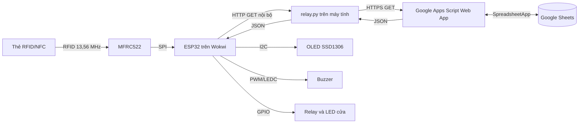

### 2.2. Kiến trúc hệ thống thật dự kiến

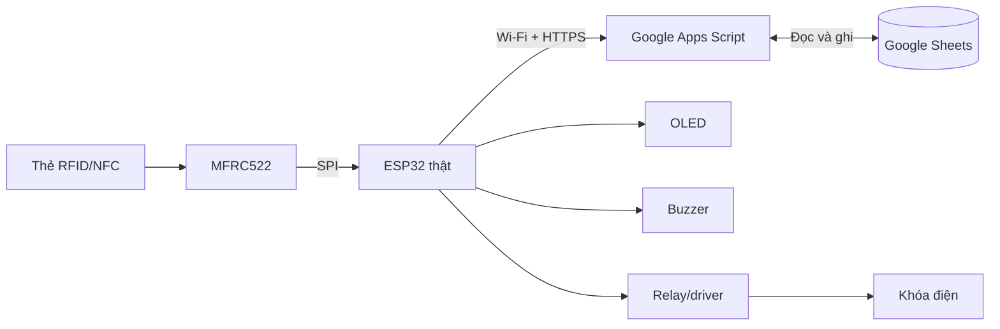

Trong hệ thống thật, `relay.py` bị loại bỏ. ESP32 phải dùng kết nối TLS, xác minh chứng thư và gửi yêu cầu trực tiếp tới URL `/exec` của Apps Script.

### 2.3. Phân chia trách nhiệm

| Thành phần | Trách nhiệm chính | Không chịu trách nhiệm |
| --- | --- | --- |
| ESP32 | Đọc thẻ, gửi UID, nhận kết quả, điều khiển thiết bị | Không quyết định người dùng có được điểm danh hay không |
| `relay.py` | Chuyển tiếp HTTP nội bộ sang HTTPS và kiểm tra JSON cơ bản | Không xử lý nghiệp vụ điểm danh |
| Apps Script | Nhận diện vai trò, quản lý phiên, chống trùng, tạo phản hồi | Không trực tiếp điều khiển phần cứng |
| Google Sheets | Lưu danh mục và dữ liệu nghiệp vụ | Không tự nhận yêu cầu từ ESP32 |
| Dashboard | Trình bày dữ liệu theo phiên | Không phải nguồn trạng thái nghiệp vụ chính |

### 2.4. Trình tự một lần quét

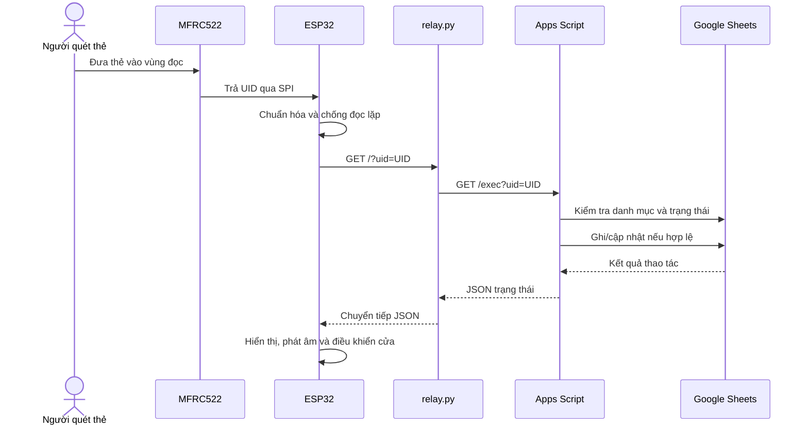

---

## 3. Phần cứng và giao tiếp

### 3.1. Bảng nối chân

| Thiết bị | Chân thiết bị | ESP32 | Giao tiếp/chức năng |
| --- | --- | --- | --- |
| MFRC522 | SDA/SS | GPIO 5 | SPI chip select |
| MFRC522 | RST | GPIO 4 | Reset đầu đọc |
| MFRC522 | SCK | GPIO 18 | SPI clock |
| MFRC522 | MISO | GPIO 19 | Dữ liệu từ đầu đọc |
| MFRC522 | MOSI | GPIO 23 | Dữ liệu tới đầu đọc |
| OLED SSD1306 | SDA | GPIO 21 | I2C data |
| OLED SSD1306 | SCL | GPIO 22 | I2C clock |
| Buzzer | Signal | GPIO 25 | PWM/LEDC |
| Relay | IN | GPIO 26 | GPIO digital |

### 3.2. Các giao thức

| Liên kết | Giao thức | Dữ liệu |
| --- | --- | --- |
| Thẻ ↔ MFRC522 | RFID 13,56 MHz | UID |
| MFRC522 ↔ ESP32 | SPI | Lệnh và UID |
| ESP32 → OLED | I2C, địa chỉ `0x3C` | Nội dung hiển thị |
| ESP32 → buzzer | LEDC/PWM | Tần số và thời lượng |
| ESP32 → relay | GPIO | Bật/tắt cửa |
| ESP32 → relay Python | HTTP GET | UID trong query string |
| Relay Python → Apps Script | HTTPS GET | UID trong query string |
| Apps Script ↔ Sheets | `SpreadsheetApp` | Mảng dữ liệu và ô |
| Các lớp phần mềm | JSON | Trạng thái và thông tin người dùng |

---

## 4. Cấu trúc chương trình

```text
nhapmoniot-project/
├── src/
│   ├── main.cpp              # Khởi tạo, đọc thẻ và vòng lặp chính
│   ├── DiemDanh.cpp          # Wi-Fi, HTTP, JSON và xử lý kết quả
│   ├── ManHinh.cpp           # Điều khiển OLED
│   └── ThietBi.cpp           # Buzzer và relay cửa
├── include/
│   ├── CauHinh.h             # GPIO, Wi-Fi, URL và timeout
│   ├── DiemDanh.h            # Trạng thái và giao diện nghiệp vụ
│   ├── ManHinh.h             # Giao diện OLED
│   └── ThietBi.h             # Giao diện buzzer/relay
├── apps-script/Code.gs       # Backend và Dashboard Google Sheets
├── relay.py                  # Cầu nối mô phỏng
├── diagram.json              # Sơ đồ Wokwi
├── platformio.ini            # Môi trường build
└── wokwi.toml                # Đường dẫn firmware Wokwi
```

---

## 5. Thuật toán hệ thống ESP32

### 5.1. Chức năng của firmware

Firmware thực hiện năm nhóm chức năng:

1. Khởi tạo RFID, OLED, buzzer, relay và Wi-Fi.
2. Phát hiện và đọc UID thẻ.
3. Chống một thẻ bị xử lý liên tục trong thời gian ngắn.
4. Gửi UID tới relay và đọc JSON phản hồi.
5. Ánh xạ trạng thái phản hồi thành OLED, âm báo và trạng thái cửa.

### 5.2. Lưu đồ khởi động `setup()`

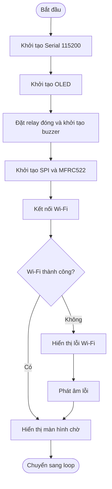

Việc Wi-Fi lỗi không làm chương trình dừng vĩnh viễn. Khi có thẻ được quét, `guiDiemDanh()` sẽ thử kết nối lại trước khi gửi yêu cầu.

### 5.3. Lưu đồ vòng lặp `loop()`

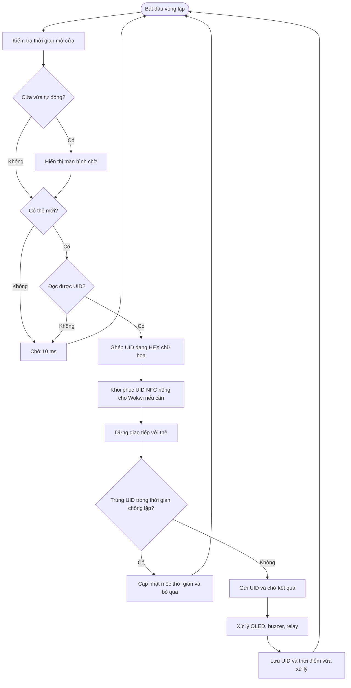

### 5.4. Thuật toán đọc và chuẩn hóa UID

- Duyệt các byte trong `rfid.uid.uidByte`.
- Thêm ký tự `0` trước byte nhỏ hơn `0x10` để mỗi byte có hai chữ số.
- Đổi từng byte sang chuỗi hexadecimal.
- Chuyển toàn bộ chuỗi sang chữ hoa.
- Trước khi gửi, tiếp tục loại dấu `:` và khoảng trắng.

Ví dụ:

```text
Byte thẻ: 04 11 22 33 44 55 66
UID gửi:  04112233445566
```

Firmware có workaround mô phỏng: nếu MFRC522 Wokwi chỉ trả `04112233` cho preset NFC xám, UID được đổi thành `04112233445566`. Quy tắc này không dùng cho phần cứng thật.

### 5.5. Thuật toán kết nối Wi-Fi

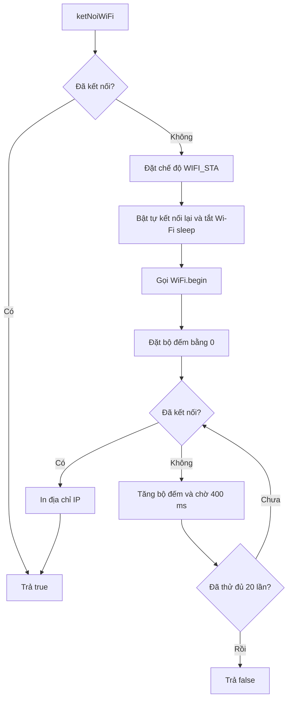

Thời gian chờ tối đa theo cấu hình hiện tại xấp xỉ `20 × 400 ms = 8 giây`, chưa tính thời gian xử lý nội bộ.

### 5.6. Thuật toán gửi yêu cầu `guiDiemDanh()`

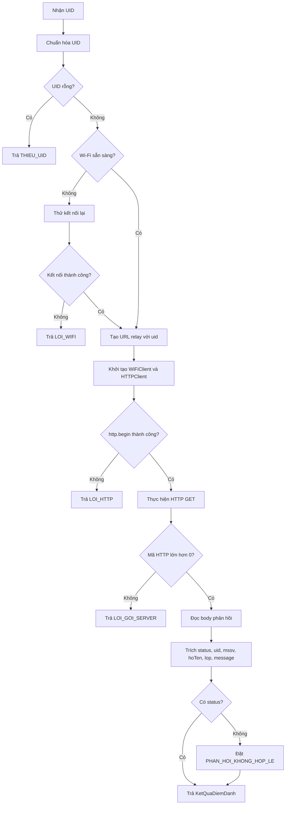

Firmware hiện dùng parser chuỗi đơn giản thay vì thư viện JSON. Parser phù hợp với object phẳng đang dùng nhưng không phải parser JSON tổng quát.

### 5.7. Thuật toán xử lý kết quả

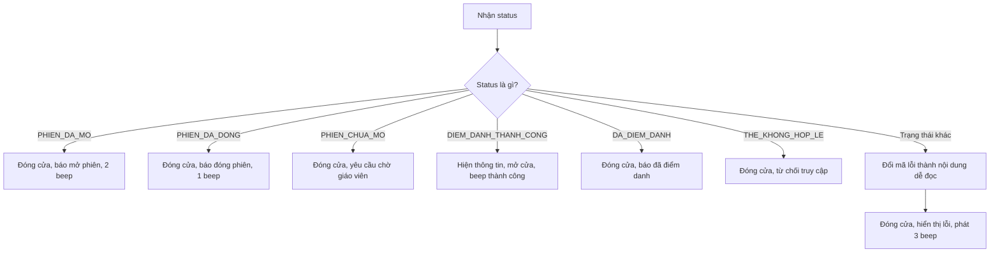

### 5.8. Điều khiển cửa không chặn

Khi điểm danh thành công, `moCua()` bật relay và lưu giá trị `millis()`. Hàm không chờ ba giây tại chỗ. Trong mỗi vòng `loop()`, `capNhatCua()` so sánh thời gian hiện tại với thời điểm mở. Khi đủ 3000 ms, relay được tắt. Nhờ đó chương trình vẫn tiếp tục chạy trong lúc cửa mở.

### 5.9. Chức năng từng module ESP32

| Module/hàm | Chức năng | Đầu vào | Đầu ra/tác động |
| --- | --- | --- | --- |
| `main.cpp/setup()` | Khởi tạo toàn hệ thống | Không | Thiết bị sẵn sàng |
| `main.cpp/loop()` | Điều phối liên tục | Trạng thái RFID và cửa | Gọi xử lý lần quét |
| `layUID()` | Ghép UID từ các byte | `rfid.uid` | Chuỗi HEX chữ hoa |
| `laLanQuetLap()` | Chống xử lý lặp | UID, `millis()` | `true/false` |
| `ketNoiWiFi()` | Kết nối hoặc kết nối lại | Cấu hình Wi-Fi | `true/false` |
| `guiDiemDanh()` | Gọi relay và đọc JSON | UID | `KetQuaDiemDanh` |
| `xuLyKetQua()` | Ánh xạ trạng thái | `KetQuaDiemDanh` | OLED/buzzer/relay |
| `khoiTaoManHinh()` | Khởi tạo SSD1306 | Địa chỉ và chân I2C | Cờ OLED sẵn sàng |
| `hienThiSinhVien()` | Hiện thông tin sinh viên | Tên, MSSV, lớp | Nội dung OLED |
| `khoiTaoThietBi()` | Đặt trạng thái an toàn | Cấu hình GPIO/LEDC | Relay đóng, buzzer sẵn sàng |
| `moCua()/dongCua()` | Điều khiển relay | Không | Thay đổi trạng thái cửa |
| `capNhatCua()` | Tự đóng sau timeout | `millis()` | Cửa đóng sau 3 giây |

---

## 6. Thuật toán relay Python

### 6.1. Mục đích

`relay.py` chỉ giải quyết đường truyền trong mô phỏng. ESP32 trên Wokwi gọi `http://host.wokwi.internal:3000/`; relay nhận yêu cầu này rồi gọi HTTPS tới Apps Script.

### 6.2. Endpoint

| Method và route | Chức năng | Kết quả |
| --- | --- | --- |
| `GET /health` | Kiểm tra relay đang chạy | JSON `RELAY_SAN_SANG` |
| `GET /?uid=...` | Chuyển tiếp UID | JSON của Apps Script |
| Route khác | Từ chối đường dẫn sai | HTTP 404, `LOI_DUONG_DAN` |

### 6.3. Lưu đồ xử lý yêu cầu

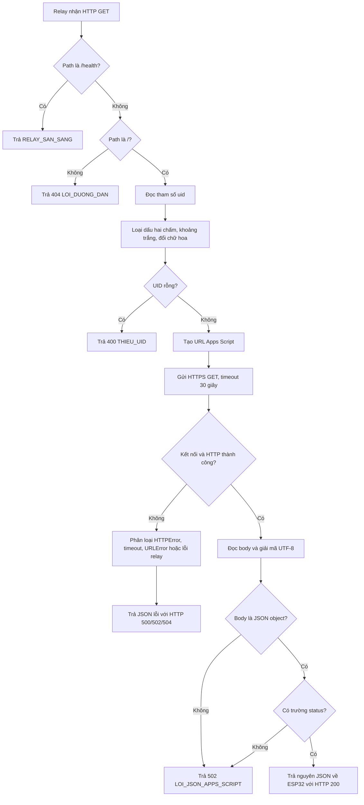

### 6.4. Xử lý lỗi relay

| Tình huống | HTTP relay trả | `status` |
| --- | ---: | --- |
| Thiếu UID | 400 | `THIEU_UID` |
| Sai route | 404 | `LOI_DUONG_DAN` |
| Apps Script trả HTTP lỗi | 502 | `LOI_APPS_SCRIPT` |
| Google quá thời gian | 504 | `LOI_TIMEOUT_GOOGLE` |
| Không kết nối được Google | 502 | `LOI_KET_NOI_GOOGLE` |
| Body không phải JSON object hợp lệ | 502 | `LOI_JSON_APPS_SCRIPT` |
| Lỗi Python không dự kiến | 500 | `LOI_RELAY` |

### 6.5. Đặc điểm hoạt động

- Dùng `ThreadingHTTPServer`, do đó có thể nhận nhiều kết nối trên các thread khác nhau.
- `daemon_threads = True` để thread không giữ tiến trình khi server dừng.
- `allow_reuse_address = True` để dễ khởi động lại cổng 3000.
- Luôn đóng kết nối sau phản hồi bằng header `Connection: close`.
- Không cache phản hồi.
- Không retry và không có hàng đợi offline.
- Không xác thực UID và không quyết định vai trò người dùng.

---

## 7. Thuật toán Google Apps Script và Google Sheets

### 7.1. Vai trò

Apps Script là lớp nghiệp vụ trung tâm. Đây là nơi quyết định:

- UID thuộc giáo viên, sinh viên hay thẻ lạ.
- Phiên được mở hay đóng.
- Sinh viên có được điểm danh hay không.
- Lần điểm danh có bị trùng không.
- Dữ liệu nào phải ghi vào Sheets.
- JSON trạng thái nào trả về ESP32.

### 7.2. Cấu trúc dữ liệu

#### Sheet `SinhVien`

| UID | MSSV | HoTen | Lop |
| --- | --- | --- | --- |

#### Sheet `GiaoVien`

| UID | MaGV | HoTen | BoMon |
| --- | --- | --- | --- |

#### Sheet `PhienHoc`

| MaBuoi | UIDGiaoVien | MaGV | HoTenGiaoVien | ThoiGianMo | ThoiGianDong | TrangThai |
| --- | --- | --- | --- | --- | --- | --- |

#### Sheet `DiemDanh`

| ThoiGian | UID | MSSV | HoTen | Lop | TrangThai | MaBuoi |
| --- | --- | --- | --- | --- | --- | --- |

Khóa chống trùng nghiệp vụ là cặp `UID + MaBuoi`. `PhienHoc` là nguồn xác định phiên đang mở; Dashboard không phải nguồn trạng thái.

### 7.3. Lưu đồ tổng quát `doGet()`

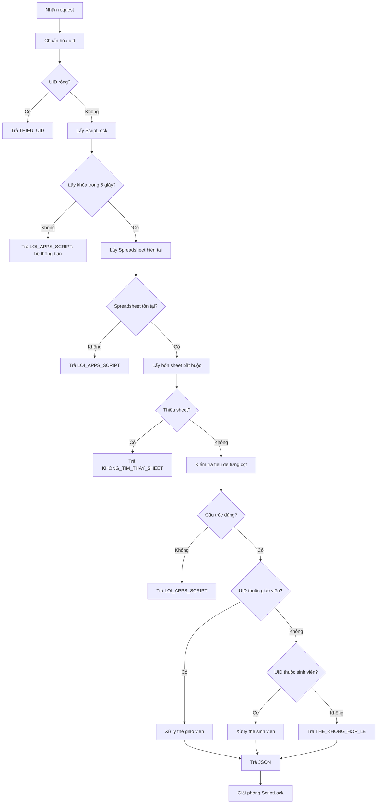

Khóa được giải phóng trong `finally`, kể cả khi hàm trả về sớm hoặc có exception.

### 7.4. Thuật toán xử lý thẻ giáo viên

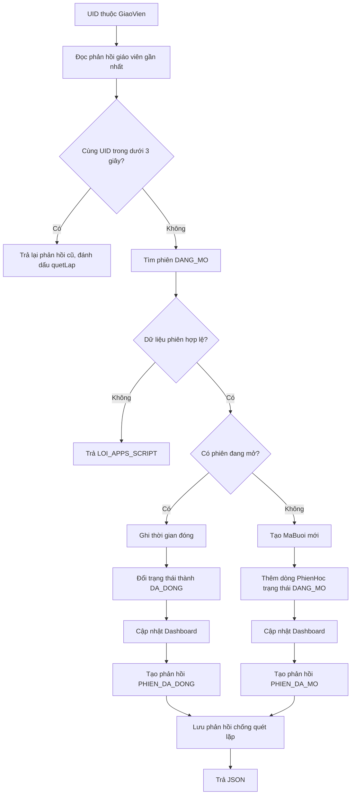

Hiện tại, nếu đã có một phiên mở thì bất kỳ giáo viên hợp lệ nào quét thẻ cũng đóng phiên đó. Hệ thống chưa kiểm tra UID người đóng có trùng UID người mở hay không.

### 7.5. Thuật toán tạo mã buổi

Mã có dạng `ByyMMdd-NN`.

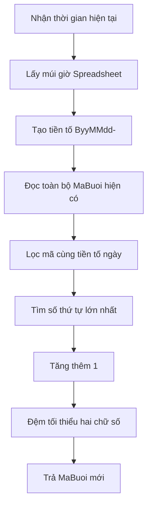

Ví dụ trong ngày 05/08/2026: `B260805-01`, `B260805-02`, `B260805-03`.

### 7.6. Thuật toán xử lý thẻ sinh viên

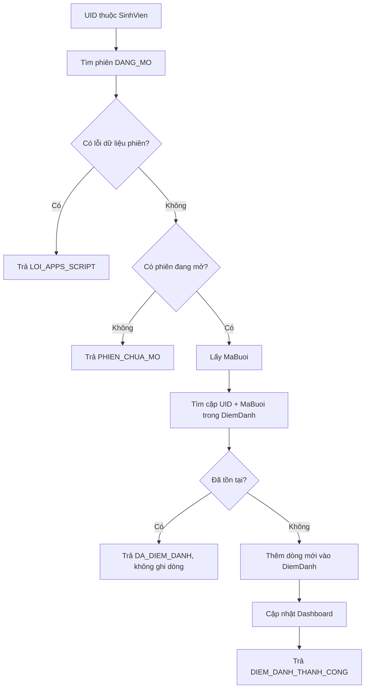

### 7.7. Thuật toán kiểm tra phiên đang mở

`timPhienDangMo()` duyệt toàn bộ dữ liệu trong `PhienHoc`:

- Không thấy dòng `DANG_MO`: trả không có phiên.
- Thấy đúng một dòng: trả số dòng, `MaBuoi` và UID giáo viên.
- Thấy nhiều hơn một dòng: trả lỗi dữ liệu.
- Phiên `DANG_MO` thiếu `MaBuoi`: trả lỗi dữ liệu.

### 7.8. Thuật toán chống điểm danh trùng

`daDiemDanhTrongPhien()` đọc các dòng `DiemDanh`, sau đó so sánh đồng thời:

```text
UID dòng hiện tại == UID sinh viên
VÀ
MaBuoi dòng hiện tại == MaBuoi đang mở
```

Chỉ khi cả hai điều kiện đúng mới được xem là đã điểm danh. Vì vậy cùng UID vẫn được ghi ở một `MaBuoi` khác.

### 7.9. Dashboard

Dashboard sử dụng các ô điều khiển:

| Ô | Chức năng |
| --- | --- |
| `C3` | Chọn mã buổi cần xem |
| `F3` | Checkbox thực hiện xem phiên |
| `K5` | Mã buổi đang hiển thị |
| `K6` | Mã buổi được chọn thủ công |
| `A9:F...` | Vùng dữ liệu điểm danh được chép vào Dashboard |

#### Lưu đồ cập nhật Dashboard

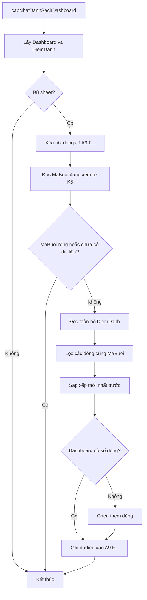

### 7.10. Chức năng các hàm Apps Script

| Hàm | Chức năng chính |
| --- | --- |
| `onOpen()` | Tạo menu RFID và cấu hình Dashboard khi mở Sheet |
| `onEdit(e)` | Bắt sự kiện checkbox xem phiên |
| `cauHinhDashboard()` | Tạo validation, checkbox và làm mới Dashboard |
| `xemPhienDaChon()` | Chuyển Dashboard sang phiên người dùng chọn |
| `xemPhienMacDinh()` | Trở về phiên hiện tại/gần nhất |
| `capNhatDanhSachDashboard()` | Lọc, sắp xếp và chép dữ liệu vào Dashboard |
| `doGet(e)` | Endpoint chính nhận UID |
| `layCacSheet()` | Lấy và kiểm tra sự tồn tại của sheet bắt buộc |
| `kiemTraCauTrucCacSheet()` | Kiểm tra đúng tiêu đề cột |
| `timGiaoVienTheoUID()` | Tra UID trong danh mục giáo viên |
| `timSinhVienTheoUID()` | Tra UID trong danh mục sinh viên |
| `xuLyTheGiaoVien()` | Mở hoặc đóng phiên |
| `xuLyTheSinhVien()` | Kiểm tra phiên, chống trùng và ghi điểm danh |
| `timPhienDangMo()` | Bảo đảm có tối đa một phiên mở |
| `daDiemDanhTrongPhien()` | Kiểm tra khóa `UID + MaBuoi` |
| `taoMaBuoi()` | Sinh mã buổi theo ngày và số thứ tự |
| `lay/luuPhanHoiGiaoVienGanNhat()` | Chống quét giáo viên lặp trong 3 giây |
| `traJSON()` | Tạo phản hồi JSON cho Web App |

---

## 8. Các trạng thái và phản hồi đầu cuối

| `status` | Nguồn tạo | Ý nghĩa | Hành động ESP32 |
| --- | --- | --- | --- |
| `DIEM_DANH_THANH_CONG` | Apps Script | Đã thêm dòng điểm danh | Hiện thông tin, beep, mở cửa |
| `DA_DIEM_DANH` | Apps Script | UID đã có trong phiên | Báo trùng, giữ cửa đóng |
| `THE_KHONG_HOP_LE` | Apps Script | UID không thuộc danh mục | Cảnh báo, giữ cửa đóng |
| `PHIEN_DA_MO` | Apps Script | Giáo viên vừa mở phiên | Báo mở phiên |
| `PHIEN_DA_DONG` | Apps Script | Giáo viên vừa đóng phiên | Báo đóng phiên |
| `PHIEN_CHUA_MO` | Apps Script | Không có phiên mở | Yêu cầu chờ giáo viên |
| `THIEU_UID` | Relay/Apps Script | Request không có UID | Báo lỗi |
| `KHONG_TIM_THAY_SHEET` | Apps Script | Thiếu sheet bắt buộc | Báo lỗi |
| `LOI_APPS_SCRIPT` | Relay/Apps Script | Backend hoặc dữ liệu lỗi | Báo lỗi |
| `LOI_TIMEOUT_GOOGLE` | Relay | Google quá thời gian | Báo lỗi |
| `LOI_KET_NOI_GOOGLE` | Relay | Không kết nối được Google | Báo lỗi |
| `LOI_JSON_APPS_SCRIPT` | Relay | Phản hồi không đúng JSON | Báo lỗi |
| `LOI_RELAY` | Relay | Lỗi Python ngoài dự kiến | Báo lỗi |
| `LOI_WIFI` | ESP32 | Mất Wi-Fi | Báo lỗi |
| `LOI_HTTP` | ESP32 | Không khởi tạo HTTP client | Báo lỗi |
| `LOI_GOI_SERVER` | ESP32 | Không gọi được relay | Báo lỗi |

---

## 9. Tính nhất quán và an toàn dữ liệu

### 9.1. Ba lớp chống lặp

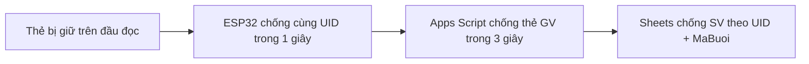

- Lớp ESP32 giảm request lặp từ đầu đọc.
- Lớp Apps Script ngăn một lần quét giáo viên mở rồi đóng phiên ngay.
- Lớp nghiệp vụ đảm bảo sinh viên không có hai dòng trong cùng buổi.

### 9.2. Khóa đồng thời

`ScriptLock` bao quanh toàn bộ nghiệp vụ `doGet()`. Mục đích là tránh hai request cùng lúc đều đọc trạng thái cũ rồi cùng ghi dữ liệu. Thời gian chờ khóa tối đa là 5 giây. Nếu không lấy được khóa, request trả lỗi để người dùng quét lại.

### 9.3. Trạng thái an toàn của cửa

- Relay được đặt về mức tắt trước khi cấu hình chân OUTPUT.
- Mọi trạng thái lỗi đều gọi đóng cửa.
- Điểm danh trùng, thẻ lạ và phiên chưa mở không mở cửa.
- Chỉ `DIEM_DANH_THANH_CONG` gọi `moCua()`.
- Cửa tự đóng sau khoảng ba giây.

---

## 10. Kịch bản kiểm thử chức năng

| STT | Tiền điều kiện | Thao tác | Kết quả mong đợi |
| ---: | --- | --- | --- |
| 1 | Hệ thống chưa có phiên mở | Khởi động | OLED chờ, relay đóng |
| 2 | Chưa có phiên mở | Sinh viên hợp lệ quét | `PHIEN_CHUA_MO`, không ghi dòng |
| 3 | Chưa có phiên mở | Giáo viên quét | Tạo phiên `DANG_MO` |
| 4 | Vừa quét thẻ giáo viên | Quét lại dưới 3 giây | Trả phản hồi cũ, không đóng phiên |
| 5 | Có một phiên mở | Sinh viên hợp lệ quét | Ghi một dòng, cửa mở 3 giây |
| 6 | Sinh viên đã điểm danh | Quét lại | `DA_DIEM_DANH`, không thêm dòng |
| 7 | Có phiên mở | UID lạ quét | `THE_KHONG_HOP_LE` |
| 8 | Có phiên mở | Giáo viên quét sau 3 giây | Phiên chuyển `DA_DONG` |
| 9 | Phiên đã đóng | Sinh viên quét | `PHIEN_CHUA_MO` |
| 10 | Cùng ngày đã có `-01` | Mở phiên mới | Tạo mã kết thúc `-02` |
| 11 | Có hai dòng `DANG_MO` do sửa tay | Quét bất kỳ thẻ hợp lệ | `LOI_APPS_SCRIPT` |
| 12 | Thiếu một sheet bắt buộc | Gửi UID | `KHONG_TIM_THAY_SHEET` |
| 13 | Sai tiêu đề cột | Gửi UID | `LOI_APPS_SCRIPT` |
| 14 | Relay Python dừng | Quét thẻ | ESP32 báo không gọi được server |
| 15 | Google timeout | Quét thẻ | `LOI_TIMEOUT_GOOGLE`, cửa đóng |
| 16 | Chọn phiên cũ | Bật checkbox `F3` | Dashboard hiển thị đúng phiên |

---

## 11. Hạn chế và rủi ro

### 11.1. Nghiệp vụ

- Toàn bộ Spreadsheet chỉ cho phép một phiên `DANG_MO`.
- Giáo viên khác có thể đóng phiên không phải do mình mở.
- Chưa gắn phiên với môn học, phòng học hoặc danh sách lớp cụ thể.
- Chưa tự đóng phiên theo thời gian.
- Dashboard phụ thuộc bố cục Google Sheet có sẵn.

### 11.2. Bảo mật

- UID thẻ RFID không phải bí mật và có thể bị sao chép.
- API chưa có token, nonce hoặc chữ ký HMAC.
- Request dùng `GET` để thay đổi trạng thái và UID nằm trong URL/log.
- Người biết URL Web App và UID giáo viên có thể giả lập mở/đóng phiên.
- Relay lắng nghe tại `0.0.0.0:3000`; thiết bị khác trong mạng có thể truy cập nếu firewall cho phép.
- Chưa có phân quyền người quản trị và chính sách lưu dữ liệu cá nhân.

### 11.3. Hiệu năng và độ tin cậy

- Tra cứu UID, phiên và điểm danh đều duyệt tuyến tính trên Sheet.
- Apps Script khóa toàn bộ request nên lưu lượng đồng thời bị tuần tự hóa.
- Relay không retry, không cache và không lưu hàng đợi khi mất mạng.
- Firmware dùng HTTP và một số `delay()`, có thể chặn vòng lặp.
- Parser JSON trên ESP32 chỉ phù hợp với phản hồi đơn giản hiện tại.
- Phiên bản platform và thư viện trong `platformio.ini` chưa được khóa.

---

## 12. Hướng phát triển đề xuất

### Giai đoạn 1: Hoàn thiện nguyên mẫu

1. Khóa phiên bản PlatformIO platform và thư viện.
2. Viết kiểm thử tự động cho relay và các hàm nghiệp vụ Apps Script.
3. Tạo script sinh cấu trúc Sheets/Dashboard ban đầu.
4. Bổ sung mã thiết bị và log request.

### Giai đoạn 2: Hoàn thiện nghiệp vụ

1. Chỉ cho giáo viên mở phiên được quyền đóng phiên đó.
2. Gắn phiên với môn học, lớp, phòng và lịch học.
3. Xác minh sinh viên thuộc danh sách của phiên.
4. Thêm thời gian tự đóng phiên.

### Giai đoạn 3: Triển khai phần cứng thật

1. Thay relay mô phỏng bằng driver và khóa điện phù hợp.
2. Cho ESP32 gọi HTTPS trực tiếp và xác minh chứng thư.
3. Bổ sung token hoặc chữ ký cho request.
4. Kiểm thử nguồn, nhiễu, khoảng cách đọc và trạng thái mất mạng.
5. Chạy thử dài hạn trước khi sử dụng thực tế.

---

## 13. Kết luận

Hệ thống được chia thành các lớp rõ ràng: ESP32 phụ trách tương tác vật lý, relay Python phụ trách cầu nối mô phỏng, Apps Script phụ trách nghiệp vụ và Google Sheets phụ trách lưu trữ/trình bày dữ liệu. Cách phân chia này giúp firmware không phải chứa danh sách sinh viên và cho phép cập nhật dữ liệu tập trung.

Nguyên mẫu hiện minh họa được đầy đủ chu trình mở phiên, điểm danh, chống trùng, đóng phiên và phản hồi thiết bị. Tuy nhiên, relay Python chỉ là thành phần phục vụ Wokwi; bảo mật API, phần cứng thật và độ tin cậy dài hạn vẫn cần được triển khai và kiểm thử trước khi sử dụng ngoài môi trường học tập.
